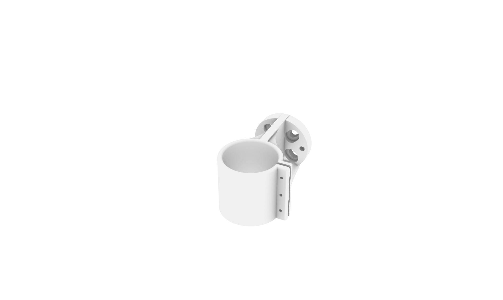

# 300-400ml Industrial Seringe Holders for ABB120-ABB140-UR3-UR5-UR10

### V1.0 Release 17-06-2022
- FirstPush on the files - all files tested and working.

## Characteristics

- Simple holder for industrial dispensing seringes of 300-400ml

* Simple 3d printed design
* No extra hardware Needed
* Realiable and strong

**Enjoy**

### Files

[3D RHINO FILE](3DPRINT-CartridgeMountABB.3dm)
[3D STL FILE](3DPRINT-CartridgeMountABB.stl)

--

### Tools Needed

1. 3D PRINTER FDM machine
	* Work space of 100x100mmx100 minimum to print all parts. We used a Original PRUSA I3 printing all parts without support at 0.3mm layer height at 40% infill. PLA plastic is resistant enough but we will recommend to print in ABS or PETG( if you change the material the fittings might change)
2. Basic Screw drivers set (Philips,flat and allen keys for 2-6mm scresws)

--
### BOM (Bill of materials)

1. [3dprinted material]()
--

### To do

*
--

### References

--
*June 2022, by [Eduardo Chamorro](http://eduardochamorro.github.io/beansreels/index.html).
-[FablabBarcelona](https://fablabbcn.org/)

LICENSE - CC BY-NC-SA
