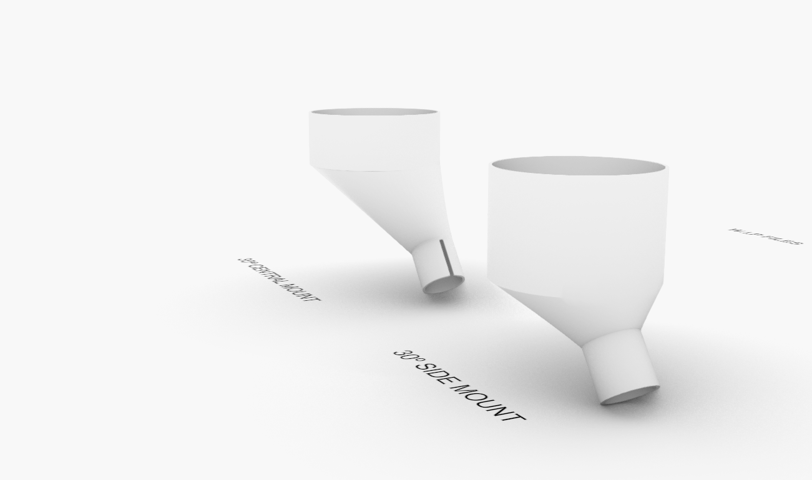

# Pellet Cone for Wasp Pellet extruder - KUKA KR150

### V3.0 Release 03-17-2019
- FirstPush on the files - all files tested and working.

## Characteristics

- 3D printed cone - fits in traditional 3d printer 200x200x200mm

* Simple 3d printed design
* No extra hardware Needed
* Realiable and strong

## Assembly Steps

**FirstStep**

- Print the parts with at least 3 walls/top/bottom and 30%infill
- Could be printed in PLA but ABS and PETG recommended
- Print without supports

**SecondStep**

- Use a metal brace to hold it on the extruder
- You can add eva foam on the circular shape holding the pipe to avoid slippering

**Enjoy**

### Troubleshooting

--

### Tools Needed

1. 3D PRINTER FDM machine
	* Work space of 200x200mmx200 minimum to print all parts. We used a Original PRUSA I3 printing all parts without support at 0.3mm layer height at 40% infill. PLA plastic is resistant enough but we will recommend to print in ABS or PETG( if you change the material the fittings might change)
2. Basic Screw drivers set (Philips,flat and allen keys for 2-6mm scresws)

--
### BOM (Bill of materials)

1. [3dprinted material]()

--

### To do

*
--

### References

--
*March 2020, by [Eduardo Chamorro](http://eduardochamorro.github.io/beansreels/index.html).*
[IAAC](https://iaac.net/)-[FablabBarcelona](https://fablabbcn.org/)

LICENSE - CC BY-NC-SA
