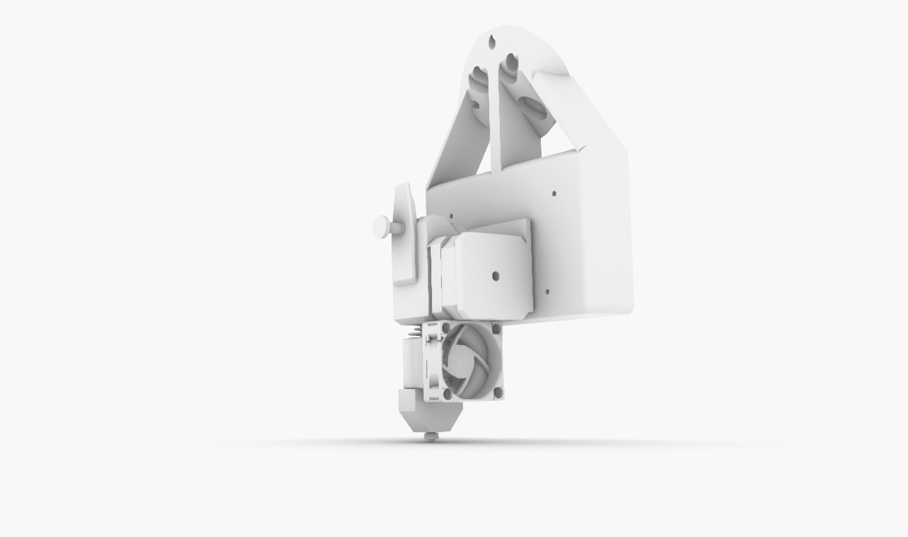
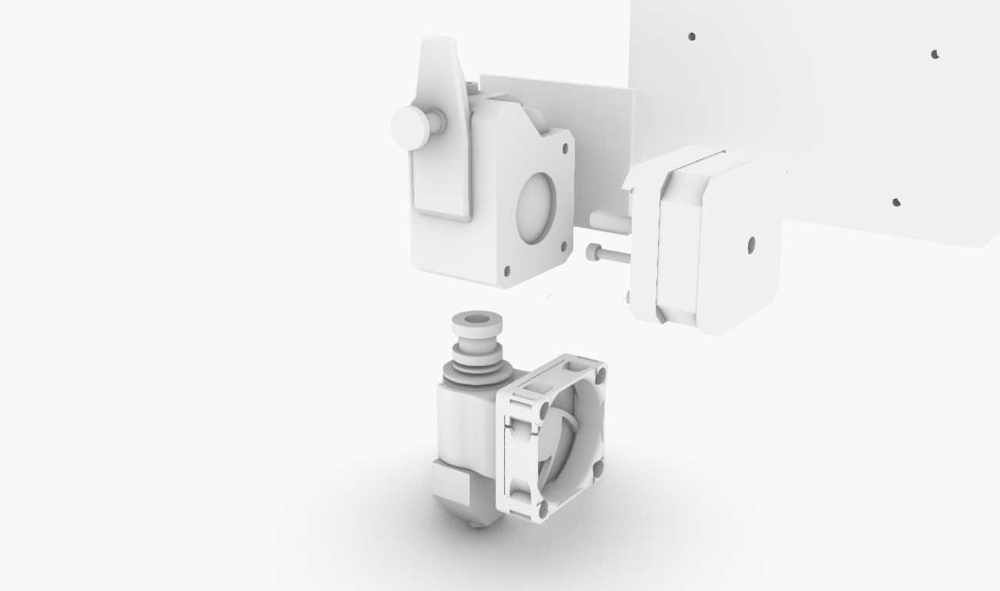
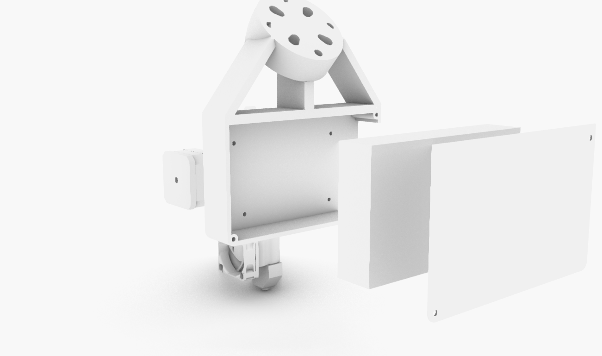
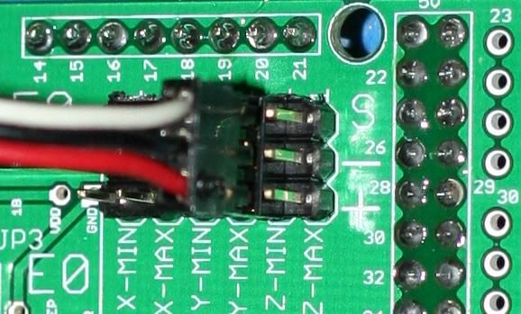
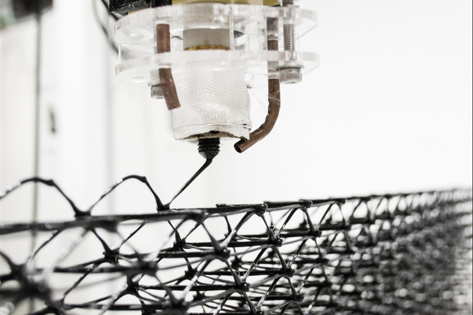
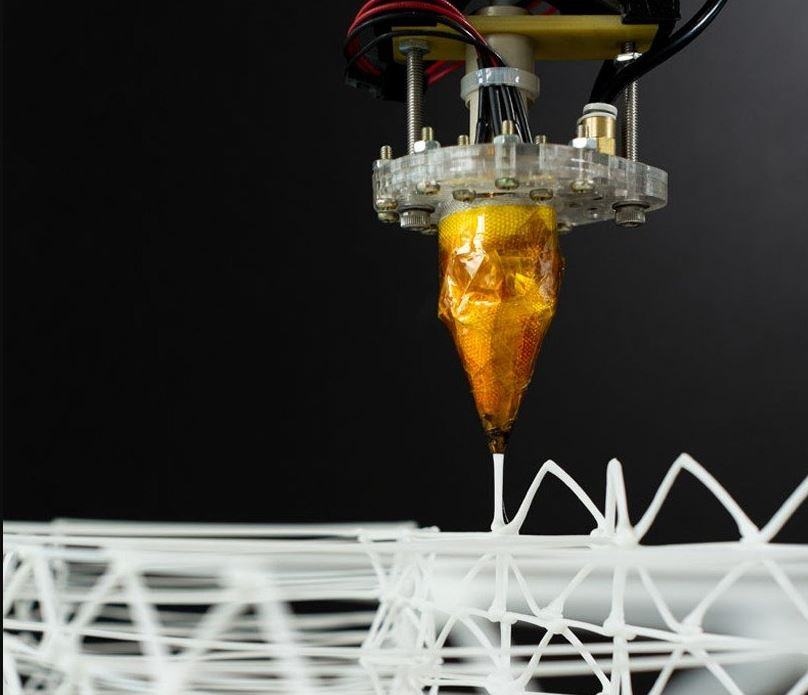

# Filament-Extruder-EndEffector

### V1.0 Release 02-12-2019
- FirstPush on the extruder after 40 hours of testruns.

## Characteristics

 **CAPABLE OF NON PLANAR PRINTING**
 This is due to a really thin noozle point

- Standalone filament extruder with commercial components.
- To be activated only with a switch or a digital signal(ON/OFF).
- Self control of temperature and coldprint avoidance(doesn´t allow to print if the temperature didn´t reached the goal Tº)
- On on/off procedure has retraction enable to avoid stringings.
- HIGHT FLOW thanks to use a dual drive gear + volcano hot end

**In our case we milled a piece of aluminium so the heatblock is custom with double cartrige**You can get the same Characteristics by buying the **[SUPERVOLCANO HOTEND](https://e3d-online.com/the-e3d-supervolcano?gclid=EAIaIQobChMIxKDem-qm6AIVgdDeCh0BWAh6EAAYASAAEgJDFfD_BwE)**

* Simple nema 17 motor
* Standart E3D V6 HOTEND
* MODIFICATION TO VOLCANO HOTEND
* Standart RAMPS1.4+ARDUINO control board
* Dual drive gear extruder
* 3mm allen screws 20-30-45mm lenght

## Assembly Steps

**FirstStep**

-Assemble the dual drive gear system to the extruder body

**SecondStep**

- Mount the extruder cooling fan on the 3d printed part and assemble it on the main extruder body
- Align the extruder wiring so it doesn´t collide with the cooling Fan

**ThirdStep**

- Fix the mega+ramps.1.4 on the main 3D printed part and close the box

**FourStep**

-Wire everything to the control board
-Load the firmware and adjust the temperature of the filament you plan to use on the code before uploading it

**FiftStep**

- Connect everything and swith it on, wait for the extruder to heat up
- Activate the extruder for printing with the swithc/endstop or by a digital 5v signal pullup or a mechanical switch(as we did)

**Enjoy**

### Troubleshooting

1. *When loading the filament, gets stuck and doesn´t print*

	* You might be using a E3D V6 Bowden type of heatsink,whick has a bigger fitting hole on the top parts,consider filling the connection with ptfe tube to don´t allow the filament to be jammed there

2. *The holes are not the correct size for my fittings*
	* Use a hand held driller with the correct size of your fittings and drill it, fmd plastic is a soft but flexible material that is really easy to drill trought.This is done in pourpose to help the screws last longer in place.

--

### Tools Needed

1. 3D PRINTER FDM machine
	* Work space of 200x200mmx200 minimum to print all parts. We used a Original PRUSA I3 printing all parts without support at 0.3mm layer height at 40% infill. PLA plastic is resistant enough but we will recommend to print in ABS or PETG( if you change the material the fittings might change)
2. Basic Screw drivers set (Philips,flat and allen keys for 2-5mm scresws)

--
### BOM (Bill of materials)

1. [Arduino Ramps1.4](https://www.amazon.es/HiLetgo-control-impresora-tablero-soporte/dp/B07DQN9N7T/ref=sr_1_11?__mk_es_ES=%C3%85M%C3%85%C5%BD%C3%95%C3%91&keywords=ramps+1.4&qid=1575457235&sr=8-11)

2. [Motor driver 2A drv8825](https://www.amazon.es/DRV8825-Controladores-M%C3%B3dulo-disipador-ejemplo-impresoras/dp/B01E0KJDTO/ref=sr_1_3_sspa?__mk_es_ES=%C3%85M%C3%85%C5%BD%C3%95%C3%91&keywords=ramps+1.4&qid=1575457235&sr=8-3-spons&psc=1&spLa=ZW5jcnlwdGVkUXVhbGlmaWVyPUExTkhKWlE0TEtZQzA1JmVuY3J5cHRlZElkPUEwNTkyNDgwMUJNTTNJUjgwSEJaTyZlbmNyeXB0ZWRBZElkPUEwNTI0Mzk4MkZRUzZEWDYxMUk2JndpZGdldE5hbWU9c3BfYXRmJmFjdGlvbj1jbGlja1JlZGlyZWN0JmRvTm90TG9nQ2xpY2s9dHJ1ZQ==)

3. [Arduino mega](https://www.amazon.es/ELEGOO-Microcontrolador-ATmega2560-ATmega16U2-Compatible/dp/B06Y3ZHPWC/ref=sr_1_1_sspa?__mk_es_ES=%C3%85M%C3%85%C5%BD%C3%95%C3%91&keywords=arduino+mega&qid=1575457226&sr=8-1-spons&psc=1&spLa=ZW5jcnlwdGVkUXVhbGlmaWVyPUEzUkxaU1BCQ1hXTkNBJmVuY3J5cHRlZElkPUEwNDQxODIyOE1RUDU2NTA4TFVZJmVuY3J5cHRlZEFkSWQ9QTA5MjQ4NTQxWU5NM0VUUk85VkdYJndpZGdldE5hbWU9c3BfYXRmJmFjdGlvbj1jbGlja1JlZGlyZWN0JmRvTm90TG9nQ2xpY2s9dHJ1ZQ==)

4. [E3D V6 1.75 EXTRUDER+VOLCANO HOT END](https://www.amazon.es/Genuine-Volcano-Eruption-Upgrade-Nozzles/dp/B07WMRMVMX/ref=sr_1_7?__mk_es_ES=%C3%85M%C3%85%C5%BD%C3%95%C3%91&keywords=VOLCANO+HOTEND&qid=1584630573&s=industrial&sr=1-7)

5. [NEMA 17](https://www.amazon.es/Longruner-Impresora-4-Cables-Conector-LD08/dp/B07FKH52S5/ref=sr_1_1_sspa?__mk_es_ES=%C3%85M%C3%85%C5%BD%C3%95%C3%91&keywords=nema17&qid=1575457302&sr=8-1-spons&spLa=ZW5jcnlwdGVkUXVhbGlmaWVyPUEyQTRMSDVGUTNDT1JPJmVuY3J5cHRlZElkPUEwMjIxMTY0MTQxTFpESFQwUUlNTSZlbmNyeXB0ZWRBZElkPUEwMTEzNTgwMjdNVDFJQVY3OFlKMiZ3aWRnZXROYW1lPXNwX2F0ZiZhY3Rpb249Y2xpY2tSZWRpcmVjdCZkb05vdExvZ0NsaWNrPXRydWU&th=1)

6. [Dual Drive Gear Extruding mechanism](https://www.amazon.es/Redrex-Extruder-Performance-Upgrading-Geeetech/dp/B07Q5RNRR6/ref=sr_1_5?__mk_es_ES=%C3%85M%C3%85%C5%BD%C3%95%C3%91&crid=AZLTPA2BYTQH&keywords=dual+drive+extruder&qid=1584630769&s=industrial&sprefix=dual%2Cindustrial%2C186&sr=1-5)

7. [Screws](https://www.amazon.es/Mcbazel-Stainless-Steel-Phillips-Screws/dp/B07KLRXNSH/ref=sr_1_5?__mk_es_ES=%C3%85M%C3%85%C5%BD%C3%95%C3%91&keywords=screw+set&qid=1575457678&sr=8-5)

8. [POWER SUPPLY(12v min 10A)](https://www.amazon.es/Uhomely-Transformer-Regulated-Switching-Universal/dp/B07L64S2BM/ref=sr_1_2_sspa?__mk_es_ES=%C3%85M%C3%85%C5%BD%C3%95%C3%91&keywords=12v+power+supply&qid=1584630689&s=industrial&sr=1-2-spons&psc=1&spLa=ZW5jcnlwdGVkUXVhbGlmaWVyPUFVOUFVUDVBVFZEVEgmZW5jcnlwdGVkSWQ9QTA4MTMxOTEyMUxaV1E0SE9YRFFVJmVuY3J5cHRlZEFkSWQ9QTA1NzU0NDUyUFAwVjJGUzdFWThZJndpZGdldE5hbWU9c3BfYXRmJmFjdGlvbj1jbGlja1JlZGlyZWN0JmRvTm90TG9nQ2xpY2s9dHJ1ZQ==)

 --
### To do
* Add serial communication for speed control of the extruder
--

### References

--
*December 2019, by [Eduardo Chamorro](http://eduardochamorro.github.io/beansreels/index.html).*
[IAAC](https://iaac.net/)-[FablabBarcelona](https://fablabbcn.org/)

LICENSE - CC BY-NC-SA
