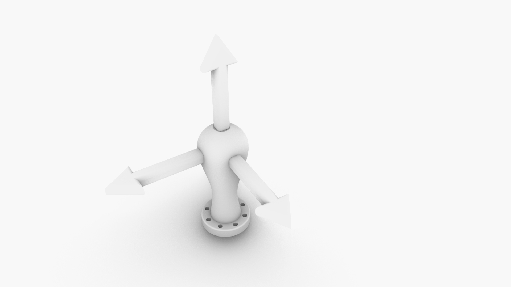

# 3 Axis Teaching Tool - KUKA KR16-2

### V1.0 Release 23-10-2020
- FirstPush on the files - all files tested and working.

## Characteristics

- 3D printed design,no extra hardware needed

* Simple 3d printed design
* No extra hardware Needed
* Realiable and strong

## Assembly Steps

**FirstStep**

- Print the parts with at least 3 walls/top/bottom and 30%infill
- Could be printed in PLA but ABS and PETG recommended
- Print with supports

**Enjoy**

### Troubleshooting

--

### Tools Needed

1. 3D PRINTER FDM machine
	* Work space of 200x200mmx200 minimum to print all parts. We used a Original PRUSA I3 printing all parts without support at 0.3mm layer height at 40% infill. PLA plastic is resistant enough but we will recommend to print in ABS or PETG( if you change the material the fittings might change)
2. Basic Screw drivers set (Philips,flat and allen keys for 2-6mm scresws)

--
### BOM (Bill of materials)

1. [3dprinted material]()

--

### To do

*
--

### References

--
*October 2020, by [Eduardo Chamorro](http://eduardochamorro.github.io/beansreels/index.html).*
[IAAC](https://iaac.net/)-[FablabBarcelona](https://fablabbcn.org/)

LICENSE - CC BY-NC-SA
