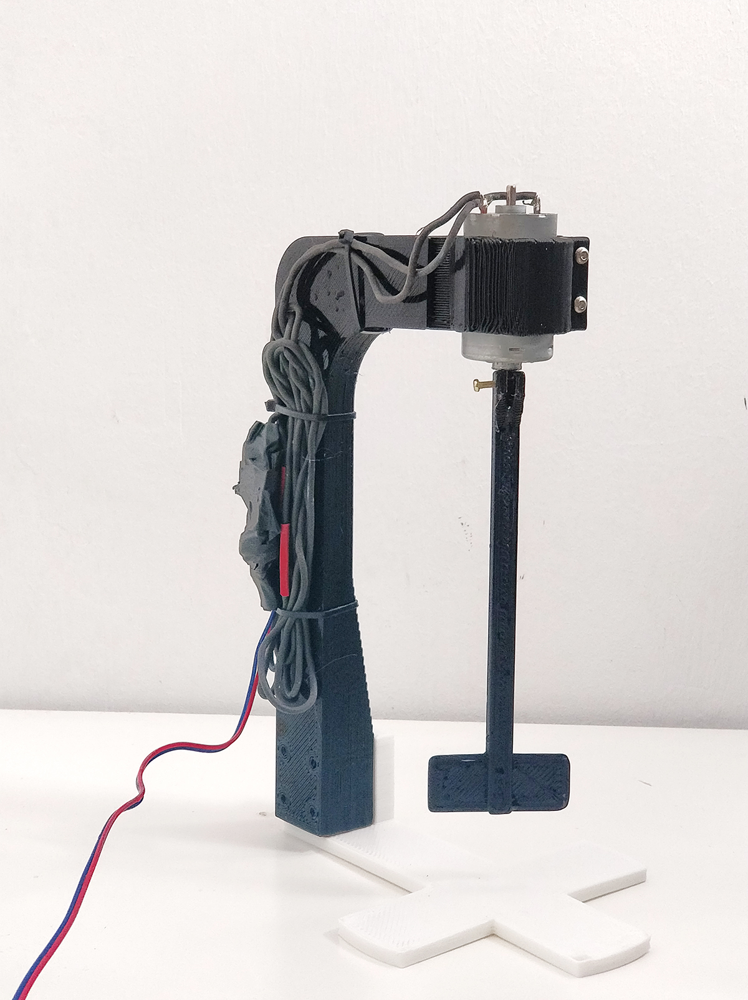
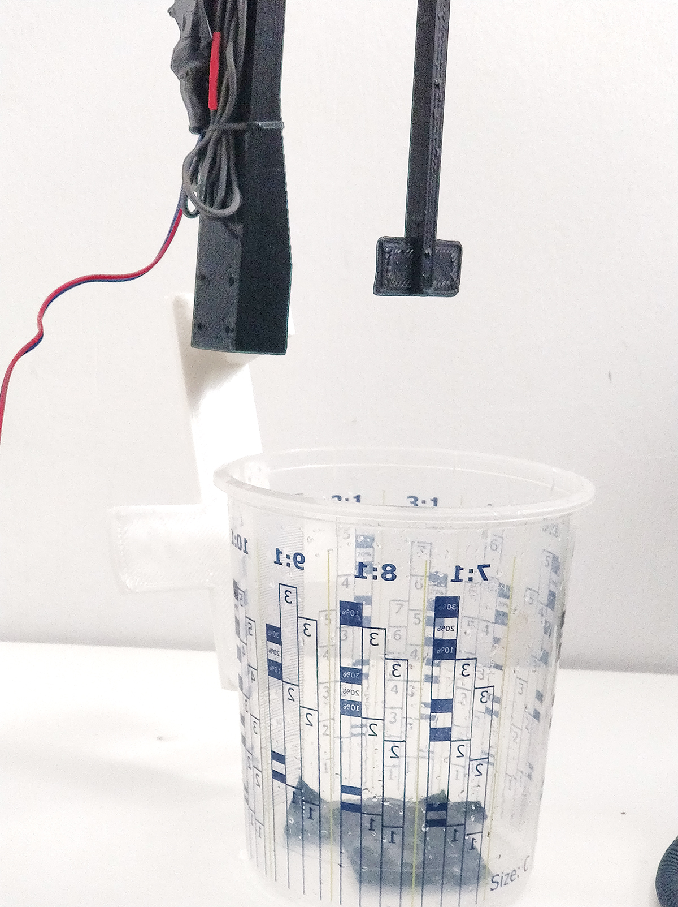
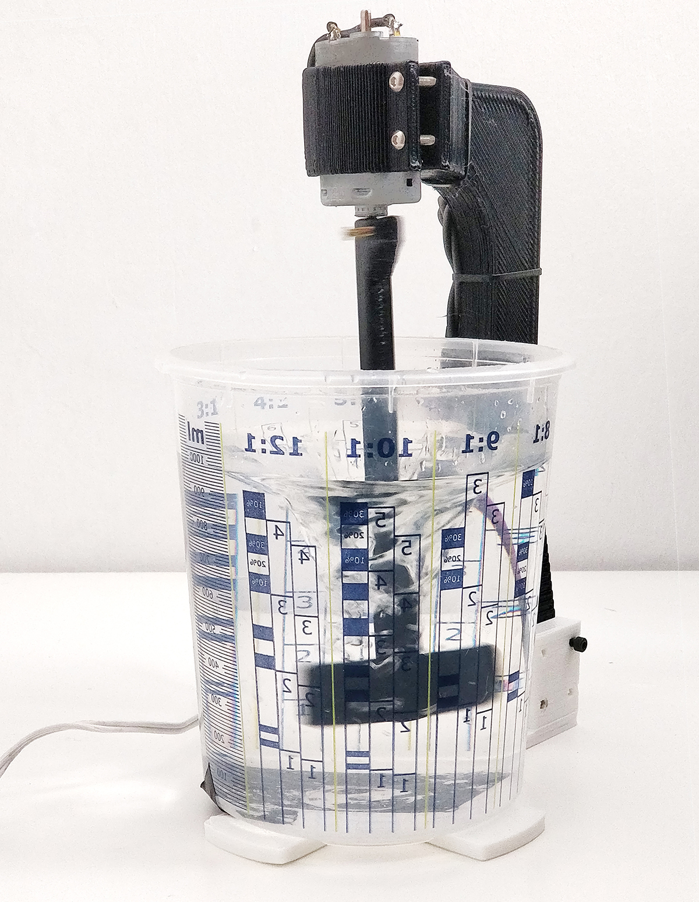

# Liquid Mixer -3D printed

### V1.0 Release 03-17-2019
- FirstPush on the files - all files tested and working.

## Characteristics

- Medium speed mixer for liquid materials-powder+liquids
- Modular and Simple
- You can fit up to a 150mm vase height (we use a vase of 140mm diameter and 150mm height)
- Almost no extra hardware, just a dc motor (30mm diameter) and power supply

* Simple 3d printed design
* Realiable and strong

## Assembly Steps

**FirstStep**

- Print the parts with at least 3 walls/top/bottom and 30%infill

**SecondStep**

- Use 1 screws of 3mm diameter <35mm lenght and 4 bolts to secure the parts to each other. on the bottom part so you can tilt the mast to introduce your mixing container

**ThirdStep**

- Mount the impeller to the motor and secure it with one screw and bolt (3mm)
- Mount the motor on the holder and secure it with the clapping screws
- You can add eva foam on the circular shape holding the pipe to avoid slippering

**FourthStep**

- Mount your mixing container in the base and power the motor.
- You might want to control the speed of the motor for that you can use an arduino [link tutorial](https://www.arduino.cc/en/Tutorial/TransistorMotorControl) or a dc controller board [link tutorial](https://www.amazon.com/Onyehn-Voltage-Controller-1803BK-Adjustable/dp/B07FLJ6ZHQ/ref=sr_1_5?crid=355OECLCVDK22&dchild=1&keywords=dc+motor+speed+controller&qid=1584613790&sprefix=dc+motor+%2Caps%2C241&sr=8-5)

**Enjoy**

### Troubleshooting

--

### Tools Needed

1. 3D PRINTER FDM machine
	* Work space of 200x200mmx200 minimum to print all parts. We used a Original PRUSA I3 printing all parts without support at 0.3mm layer height at 40% infill. PLA plastic is resistant enough but we will recommend to print in ABS or PETG( if you change the material the fittings might change)
2. Basic Screw drivers set (Philips,flat and allen keys for 2-6mm scresws)

--
### BOM (Bill of materials)

1. [3dprinted material](https://www.amazon.com/s?k=PLA+FILAMENT&ref=nb_sb_noss_2)
2. [Mixing vase 1L smooth-on](http://www.formx.es/tools/mixing-and-measuring/so-mixing-cup---946ml.php)
3. [screws](https://www.amazon.es/Mcbazel-Stainless-Steel-Phillips-Screws/dp/B07KLRXNSH/ref=sr_1_5?__mk_es_ES=%C3%85M%C3%85%C5%BD%C3%95%C3%91&keywords=screw+set&qid=1575457678&sr=8-5)
4. [DC MOTOR 30MM WIDE X50MM TALL-YOU CAN EASILY ADAPT ANY MOTOR YOU HAVE BY MODIFING THE FILES]()
--

### To do

*
--

### References

--
*March 2020, by [Eduardo Chamorro](http://eduardochamorro.github.io/beansreels/index.html).*
[IAAC](https://iaac.net/)-[FablabBarcelona](https://fablabbcn.org/)

LICENSE - CC BY-NC-SA
