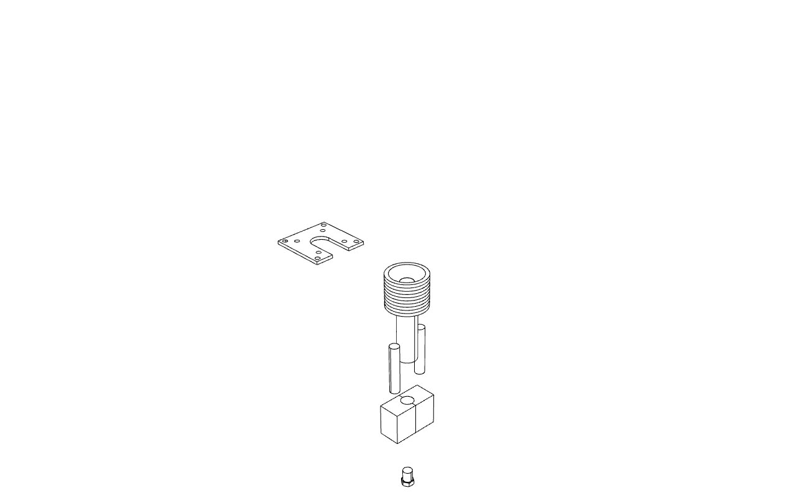

# MINI PELLET EXTRUDER

What is mini pellet extruder?
--

This is a design of minipellet extruder completely retrocompatible with normal 3d printers

### B.O.M

#### Hardware

-3 x [fan blower 40x40mm]()

- 1x [motor nema 17 geared 5:1]()

- 1x [simple collet 8mm to 8mm]()

- 2x [heating cartridge 40w 12or14v]()

- 1x [thermistor]()

- 1x [aluminium block to cut on measure]()

- 1x [pellet screw kit found in aliexpress]()

- 1x [3dprinted and aluminium parts]

### What you will find in this repo.

- Rhino Design files
- images and screen shoots for assembly
- STL 3d printed files
- components datasheets
- components specifications
- 2d files for the aluminium cut of the extruder holder

**Downloads** *Right click - save as*

- [2DFile-Aluminium holder](2daluminiumcut.dxf)
- [3dFile- BodyCoverMotor](3DPRINT-MiniPelletExtruderCover.stl)
- [3dFile- BodyCoverMotorV2.0](3DPRINT-MiniPelletExtruderCoverV2.0.stl)
- [3dFile- fanblower X2](3DPRINT-MiniPelletExtruderFanBlower.stl)
- [3dFile- fanblowercooler](3DPRINT-MiniPelletExtruderFanBlowerHeatBreak.stl)
- [3dFile- MainBodyPart](3DPRINT-MiniPelletExtruderMain.Body.stl)
- [3dFile- MainBodyPartV2.0](3DPRINT-MiniPelletExtruderMain.BodyV2.0.stl)

### Using GRBLESP32

This mini pellet extruder is retro compatible with any 3d printer.
The wiring is exactly the same as any hotend and the motor nema 17 geared can be connected in the connector or the extruder motor that comes with your PRINTER

You will need to setup and configure the STEPS for the extruder as well as all the values depending on:

- material you use
- noozle size
- print speed
- extruding speed
- retractions
- temperature

### Extras

### License
--

LICENSE - CC BY-NC-SA
### Credits

--
*March 2020, by [Eduardo Chamorro](http://eduardochamorro.github.io/beansreels/index.html).*
[IAAC](https://iaac.net/)-[FablabBarcelona](https://fablabbcn.org/)

##### Disclaimer

This hardware/software is provided "as is", and you use the hardware/software at your own risk. Under no circumstances shall any author be liable for direct, indirect, special, incidental, or consequential damages resulting from the use, misuse, or inability to use this hardware/software, even if the authors have been advised of the possibility of such damages.

