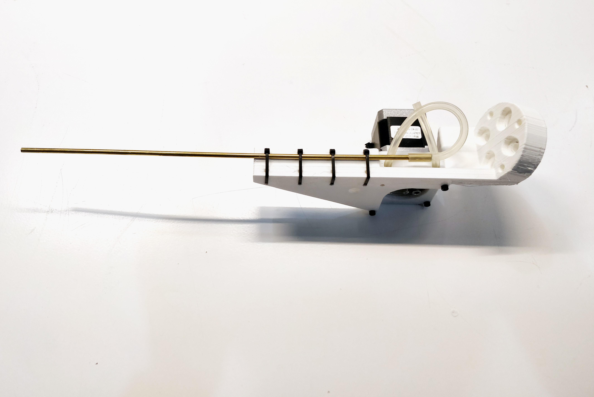

# PerilstaticPump-Extruder-EndEffector

### V1.0 Release 03-17-2019
- FirstPush on the extruder after 5 hours of testruns.

## Characteristics

- Standalone filament extruder based on offtheshelve components. To be activated only with a switch or a digital signal(ON/OFF).
- Self control of temperature and coldprint avoidance(doesn´t allow to print if the temperature didn´t reached the goal Tº)
- On on/off procedure has retraction enable to avoid stringings.

* Simple nema 17 motor
* Standart E3D V6 HOTEND
* Standart RAMPS1.4+ARDUINO control board
* Fans 40x40 x1 and 50x50 x2 size
* 3mm allen screws 20-30-45mm lenght

## Assembly Steps

**FirstStep**

- Mount the nema 17 with the threaded rod on the shaft
- Mount the free bearing on the pusher arm
- Mount both parts on the main 3d printed body
- Introduce the E3D V6 hotend on the main body and fix it with the small 3d printed bracket

**SecondStep**

- Mount the extruder cooling fan on the 3d printed part and assemble it on the main extruder body
- Align the extruder wiring so it doesn´t collide with the cooling Fan

**ThirdStep**

- Mount the big 50x50mm side fan on the big back 3d printed bracket
- Assemble that part on the main extruder body

**FourStep**

- Connect the 6mm silicon tubes
- Ziptie the long metal pipe to the holder to hold it properly in place

**Enjoy**

### Troubleshooting

1. *The material doesn´t flow*

	* Be sure to use a liquid material, check also that the bearings are pressing enought the silicon pipe

2. *The holes are not the correct size for my fittings*
	* Use a hand held driller with the correct size of your fittings and drill it, fmd plastic is a soft but flexible material that is really easy to drill trought.This is done in pourpose to help the screws last longer in place.

--

### Tools Needed

1. 3D PRINTER FDM machine
	* Work space of 100x100mmx100 minimum to print all parts. We used a Original PRUSA I3 printing all parts without support at 0.3mm layer height at 40% infill. PLA plastic is resistant enough but we will recommend to print in ABS or PETG( if you change the material the fittings might change)
2. Basic Screw drivers set (Philips,flat and allen keys for 2-5mm scresws)

--
### BOM (Bill of materials)

1. [Bearings]()

2. [Metal pipe 3mm exterior- recommend copper or aluminium]()

3. [Silicon flexible pipe 6mm]()

4. [NEMA 17](https://www.amazon.es/Longruner-Impresora-4-Cables-Conector-LD08/dp/B07FKH52S5/ref=sr_1_1_sspa?__mk_es_ES=%C3%85M%C3%85%C5%BD%C3%95%C3%91&keywords=nema17&qid=1575457302&sr=8-1-spons&spLa=ZW5jcnlwdGVkUXVhbGlmaWVyPUEyQTRMSDVGUTNDT1JPJmVuY3J5cHRlZElkPUEwMjIxMTY0MTQxTFpESFQwUUlNTSZlbmNyeXB0ZWRBZElkPUEwMTEzNTgwMjdNVDFJQVY3OFlKMiZ3aWRnZXROYW1lPXNwX2F0ZiZhY3Rpb249Y2xpY2tSZWRpcmVjdCZkb05vdExvZ0NsaWNrPXRydWU&th=1)

5. [screws](https://www.amazon.es/Mcbazel-Stainless-Steel-Phillips-Screws/dp/B07KLRXNSH/ref=sr_1_5?__mk_es_ES=%C3%85M%C3%85%C5%BD%C3%95%C3%91&keywords=screw+set&qid=1575457678&sr=8-5)
--

### To do
* Reduce the pulsation by adding more bearings (More bearings-less pulsations)
--

### References

--
*March 2020, by [Eduardo Chamorro](http://eduardochamorro.github.io/beansreels/index.html).*
[IAAC](https://iaac.net/)-[FablabBarcelona](https://fablabbcn.org/)

LICENSE - CC BY-NC-SA
