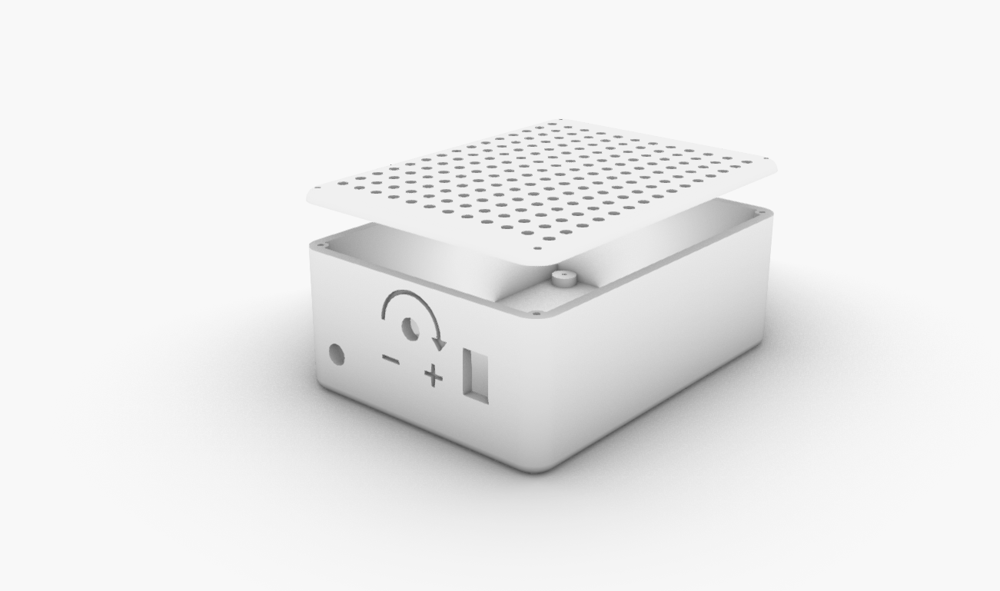

# SpindleBox

### V1.0 Release 03-17-2019
- FirstPush on the files - all files tested and working.

## Characteristics

- Spindle electronics box
- Almost no extra hardware, just a bunch of 3mm screws

* Simple 3d printed design
* Realiable and strong

## Assembly Steps

**FirstStep**

- Fit the electronics inside and secure them with Screws
- Secure the speed potentiometer FirstStep
- Add an standart dip switch to allow ON/OFF control

**SecondStep**

- Close the box
-
**Enjoy**

### Troubleshooting

--

### Tools Needed

1. 3D PRINTER FDM machine
	* Work space of 200x200mmx200 minimum to print all parts. We used a Original PRUSA I3 printing all parts without support at 0.3mm layer height at 40% infill. PLA plastic is resistant enough but we will recommend to print in ABS or PETG( if you change the material the fittings might change)
2. Basic Screw drivers set (Philips,flat and allen keys for 2-6mm scresws)

--
### BOM (Bill of materials)

1. [3dprinted material](https://www.amazon.com/s?k=PLA+FILAMENT&ref=nb_sb_noss_2)
2. [screws](https://www.amazon.es/Mcbazel-Stainless-Steel-Phillips-Screws/dp/B07KLRXNSH/ref=sr_1_5?__mk_es_ES=%C3%85M%C3%85%C5%BD%C3%95%C3%91&keywords=screw+set&qid=1575457678&sr=8-5)
4. [SPINDLE MOTOR+ ELECTRONICS](https://www.aliexpress.com/item/32702815007.html?spm=a2g0o.productlist.0.0.768dbae0ZqSlVb&algo_pvid=3afa867d-ac6d-451a-80cc-3c97a41cd0ee&algo_expid=3afa867d-ac6d-451a-80cc-3c97a41cd0ee-1&btsid=0b0a187b15845263415838262e3e37&ws_ab_test=searchweb0_0,searchweb201602_,searchweb201603_)
--

### To do

*
--

### References

--
*March 2020, by [Eduardo Chamorro](http://eduardochamorro.github.io/beansreels/index.html).*
[IAAC](https://iaac.net/)-[FablabBarcelona](https://fablabbcn.org/)

LICENSE - CC BY-NC-SA
