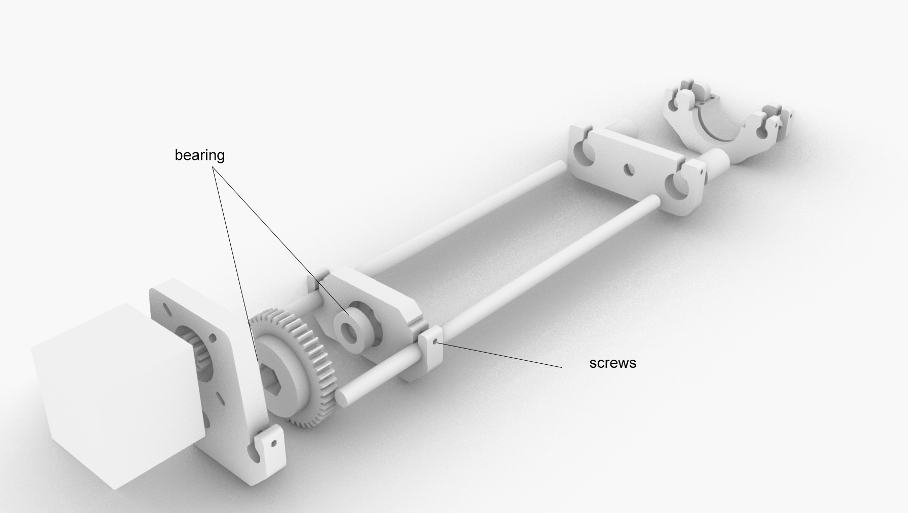
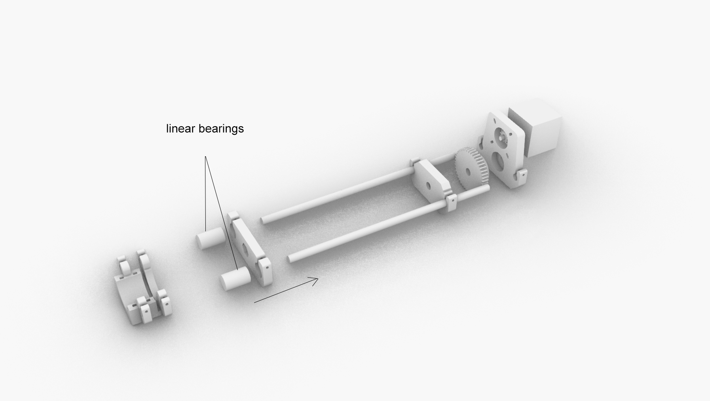
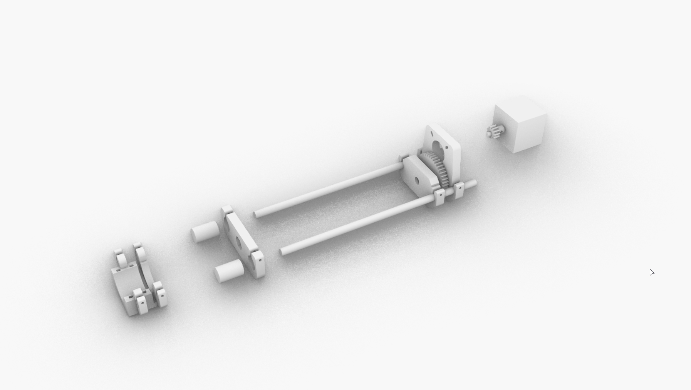
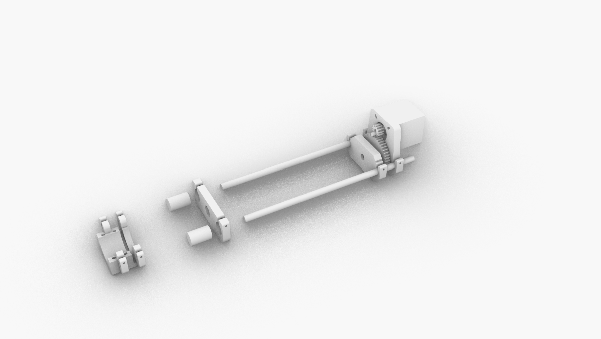
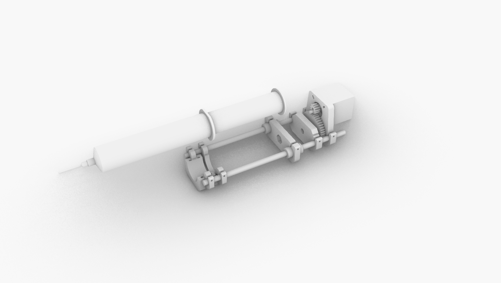
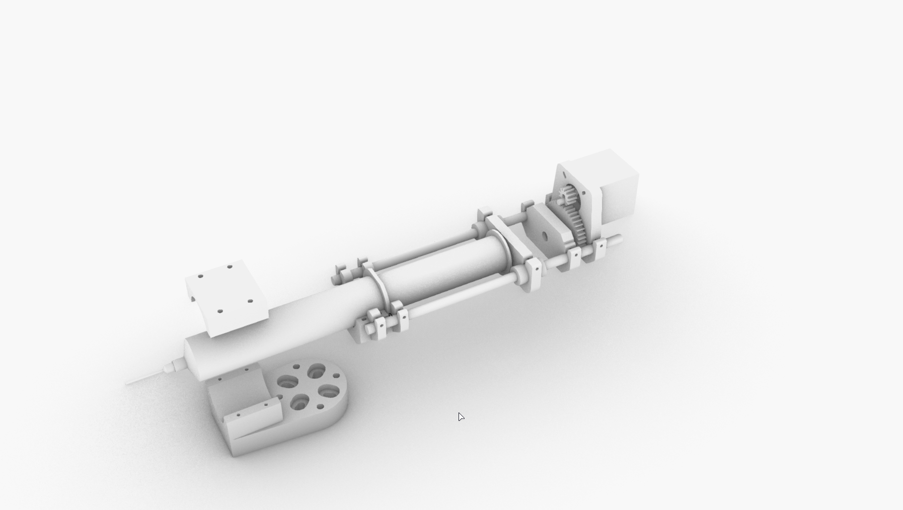
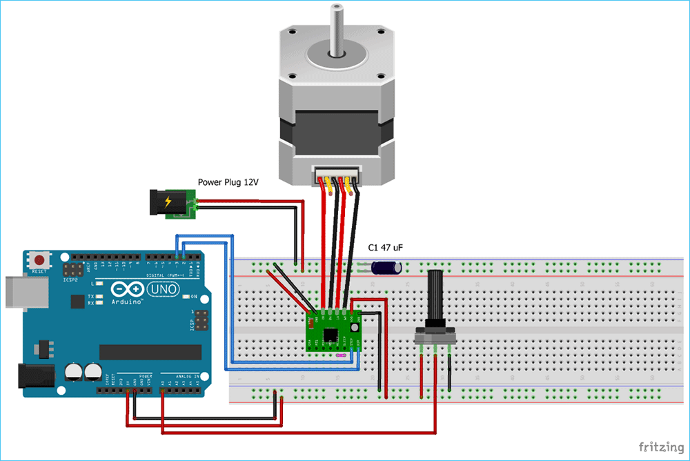

# Syringe-Extruder-EndEffector

### V1.0 Release 02-12-2019
- FirstPush on the extruder after testruns.

## Characteristics

- Standalone paste extruder based on offtheshelve components. To be activated only with a switch or a digital signal(ON/OFF) or to connect on the extruder motor of your 3d printer
- Big syringe volume compatibility 60-100ml syringe size to allow small materials test
- Reduced 5-1 gear box to augment the torque for more dense materials.

* Simple nema 17 motor
* Standart 60-100ml syringe
* Standart rails and bearings 8mm
* 3mm allen screws 20-30-45mm lenght

## Assembly Steps

**FirstStep**

- Insert the bearing on the 3d parts of the motor gear box, one bearing for the upper part and one for the lower one
- Introduce the lower part off the gear box on the metal bars and clamp it with screws

**SecondStep**

- Introduce the linear bearing on the syringe pusher and introduce them in the rails
- Clamp the bearing with screws

**ThirdStep**

- Mount the rest of the gear box and clamp it with screws so the parts and gears doesn´t move
- The treaded rod is not shown on the picture.Goes in the the middle hole and is attached to the nut of the big gear

**FourStep**

-Mount the motor in place

**FiftStep**

-Insert the syringe on the syringe holder
-Lock it in place with zipties

**SixStep**

- Select the mount you plan to use it and attach it to the robot/printer you plan to use
- Grip the syringe with the second part of the holder and thighten the screws  to grip the extruder properly.

- The closer to the top part of the syringe the better to avoid having to much unbalanced weight

**Enjoy**

### Electronics

For the electronics you need somehow to move the stepper in the proportion of amount you desire so you can either connect the motor of this extruder to the connector of the motor of the filament extruder of your 3d printer or use your own system with an arduino.(in case of robot use you will need this second one)

[Follow this guide on how to move an stepper motor with an arduino](https://circuitdigest.com/microcontroller-projects/controlling-nema-17-stepper-motor-with-arduino-and-a4988-stepper-driver-module)

### Troubleshooting

1. *The motor rotates in the oposite direction*

	* Flip two of the stepper wires of the same coil

2. *The holes are not the correct size for my fittings*
	* Use a hand held driller with the correct size of your fittings and drill it, fmd plastic is a soft but flexible material that is really easy to drill trought.This is done in pourpose to help the screws last longer in place.

--

### Tools Needed

1. 3D PRINTER FDM machine
	* Work space of 100x100mmx100 minimum to print all parts. We used a Original PRUSA I3 printing all parts without support at 0.3mm layer height at 40% infill. PLA plastic is resistant enough but we will recommend to print in ABS or PETG( if you change the material the fittings might change)
2. Basic Screw drivers set (Philips,flat and allen keys for 2-5mm scresws)

--
### BOM (Bill of materials)

1.[Syringe 60-100 ml](https://www.amazon.es/gp/product/B06XW9CL7D/ref=ppx_yo_dt_b_asin_title_o03_s00?ie=UTF8&psc=1)

2.[Motor driver 2A drv8825](https://www.amazon.es/DRV8825-Controladores-M%C3%B3dulo-disipador-ejemplo-impresoras/dp/B01E0KJDTO/ref=sr_1_3_sspa?__mk_es_ES=%C3%85M%C3%85%C5%BD%C3%95%C3%91&keywords=ramps+1.4&qid=1575457235&sr=8-3-spons&psc=1&spLa=ZW5jcnlwdGVkUXVhbGlmaWVyPUExTkhKWlE0TEtZQzA1JmVuY3J5cHRlZElkPUEwNTkyNDgwMUJNTTNJUjgwSEJaTyZlbmNyeXB0ZWRBZElkPUEwNTI0Mzk4MkZRUzZEWDYxMUk2JndpZGdldE5hbWU9c3BfYXRmJmFjdGlvbj1jbGlja1JlZGlyZWN0JmRvTm90TG9nQ2xpY2s9dHJ1ZQ==)

3.[Arduino Uno x 1 ](https://www.amazon.es/Tarjeta-Microcontrolador-ATmega328P-ATMEGA16U2-Compatible/dp/B01M7ZB2B4/ref=sr_1_7?__mk_es_ES=%C3%85M%C3%85%C5%BD%C3%95%C3%91&keywords=arduino&qid=1576603241&sr=8-7)

4.[LinearBearing x 2](https://www.amazon.es/Igus-deslizamiento-A6-Prusa-RJ4JP-01-08/dp/B079MC4KVZ/ref=sr_1_3_sspa?__mk_es_ES=%C3%85M%C3%85%C5%BD%C3%95%C3%91&keywords=rodamiento+impresora+3d&qid=1576599833&sr=8-3-spons&psc=1&spLa=ZW5jcnlwdGVkUXVhbGlmaWVyPUFEUVFKNTZJTktTUFkmZW5jcnlwdGVkSWQ9QTAyNTAwODQxV1E4NDZSMkJXOUQxJmVuY3J5cHRlZEFkSWQ9QTA2MzkxNzkyWDNOU0pMVlYwTFFXJndpZGdldE5hbWU9c3BfYXRmJmFjdGlvbj1jbGlja1JlZGlyZWN0JmRvTm90TG9nQ2xpY2s9dHJ1ZQ==)

5.[Linear bar steel 8mm x 2](https://www.amazon.es/SIENOC-Impresora-precisi%C3%B3n-Revestimiento-%C3%988mm-400mm/dp/B07TVBYCRF/ref=sr_1_14?__mk_es_ES=%C3%85M%C3%85%C5%BD%C3%95%C3%91&keywords=GUIA%2Bimpresora%2B3d&qid=1576599814&sr=8-14&th=1)

6.[Threaded rod 8mm x 1](https://www.amazon.es/Fischer-090275-Varilla-anclajes-quimicos/dp/B00109V42I/ref=sr_1_6?__mk_es_ES=%C3%85M%C3%85%C5%BD%C3%95%C3%91&keywords=varilla+roscada&qid=1576603323&sr=8-6)

7.[NEMA 17](https://www.amazon.es/Longruner-Impresora-4-Cables-Conector-LD08/dp/B07FKH52S5/ref=sr_1_1_sspa?__mk_es_ES=%C3%85M%C3%85%C5%BD%C3%95%C3%91&keywords=nema17&qid=1575457302&sr=8-1-spons&spLa=ZW5jcnlwdGVkUXVhbGlmaWVyPUEyQTRMSDVGUTNDT1JPJmVuY3J5cHRlZElkPUEwMjIxMTY0MTQxTFpESFQwUUlNTSZlbmNyeXB0ZWRBZElkPUEwMTEzNTgwMjdNVDFJQVY3OFlKMiZ3aWRnZXROYW1lPXNwX2F0ZiZhY3Rpb249Y2xpY2tSZWRpcmVjdCZkb05vdExvZ0NsaWNrPXRydWU&th=1)

8.[screws](https://www.amazon.es/Mcbazel-Stainless-Steel-Phillips-Screws/dp/B07KLRXNSH/ref=sr_1_5?__mk_es_ES=%C3%85M%C3%85%C5%BD%C3%95%C3%91&keywords=screw+set&qid=1575457678&sr=8-5)

9.[Hexagonal nut 8mm](https://www.amazon.es/AERZETIX-Tuercas-hexagonales-autoinsertables-inoxidable/dp/B075ZR4DVG/ref=sr_1_4_sspa?__mk_es_ES=%C3%85M%C3%85%C5%BD%C3%95%C3%91&keywords=tuerca+8mm&qid=1576603352&sr=8-4-spons&psc=1&smid=A1QXJ8JQ1XG0TA&spLa=ZW5jcnlwdGVkUXVhbGlmaWVyPUEyMkZOS1VMUUJYMVomZW5jcnlwdGVkSWQ9QTAyMzA4NjIzOTRRRU1QQjlDVFpQJmVuY3J5cHRlZEFkSWQ9QTA1MTI5MjgyTUlNVlpIVlFIVEFKJndpZGdldE5hbWU9c3BfYXRmJmFjdGlvbj1jbGlja1JlZGlyZWN0JmRvTm90TG9nQ2xpY2s9dHJ1ZQ==)

--

### To do
* Document Stepper driver
--

### References

--
*December 2019, by [Eduardo Chamorro](http://eduardochamorro.github.io/beansreels/index.html).*
