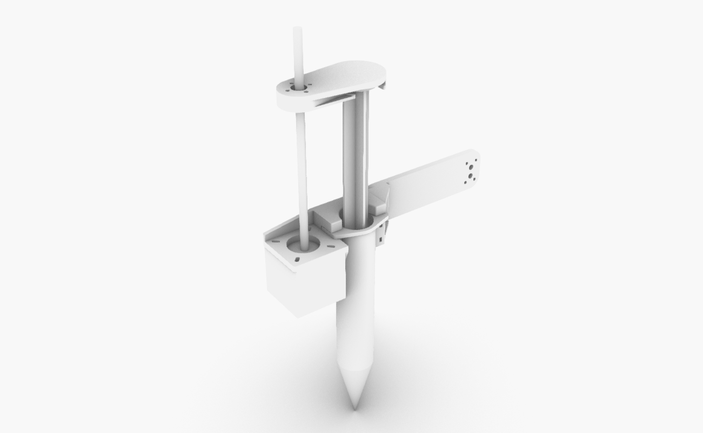

# Syringe-Extruder Direct Drive -EndEffector

### V1.0 Release 03-18-2019
- FirstPush on the extruder after testruns.

## Characteristics

- Standalone paste extruder based on offtheshelve components. To be activated only with a switch or a digital signal(ON/OFF) or to connect on the extruder motor of your 3d printer
- Big syringe volume compatibility 60-100ml syringe size to allow small materials test
- Direct drive movement to use with fluid materials.
- Not a lot of torque but posibility of doing retraction moves
- Really easy - straighforward to build

* Simple nema 17 motor with embedded  threaded shaft
* Standart 60-100ml syringe
* Threaded shaft coupler
* 3mm allen screws 20-30-45mm lenght + zipties

## Assembly Steps

**FirstStep**

- Insert the motor in the motor holder and screw it safely with 4 scres 3mm

**SecondStep**

- Introduce the acme nut of the threaded rod into the pusher part of the extruder and screw directly onto the 3d printed part

**ThirdStep**

- Rotate the pusher inside the threaded rod.

**FourStep**

-Insert the syringe on the syringe holder
-Lock it in place with zipties

**FiftStep**

- Select the mount you plan to use it and attach it to the robot/printer you plan to use
- Grip the syringe with zipties/screws

**Enjoy**

### Electronics

For the electronics you need somehow to move the stepper in the proportion of amount you desire so you can either connect the motor of this extruder to the connector of the motor of the filament extruder of your 3d printer or use your own system with an arduino.(in case of robot use you will need this second one)

[Follow this guide on how to move an stepper motor with an arduino](https://circuitdigest.com/microcontroller-projects/controlling-nema-17-stepper-motor-with-arduino-and-a4988-stepper-driver-module)

### Troubleshooting

1. *The motor rotates in the oposite direction*

	* Flip two of the stepper wires of the same coil

2. *The holes are not the correct size for my fittings*
	* Use a hand held driller with the correct size of your fittings and drill it, fmd plastic is a soft but flexible material that is really easy to drill trought.This is done in pourpose to help the screws last longer in place.

--

### Tools Needed

1. 3D PRINTER FDM machine
	* Work space of 100x100mmx100 minimum to print all parts. We used a Original PRUSA I3 printing all parts without support at 0.3mm layer height at 40% infill. PLA plastic is resistant enough but we will recommend to print in ABS or PETG( if you change the material the fittings might change)
2. Basic Screw drivers set (Philips,flat and allen keys for 2-5mm scresws)

--
### BOM (Bill of materials)

1.[Syringe 60-100 ml](https://www.amazon.es/gp/product/B06XW9CL7D/ref=ppx_yo_dt_b_asin_title_o03_s00?ie=UTF8&psc=1)

2.[Motor driver 2A drv8825](https://www.amazon.es/DRV8825-Controladores-M%C3%B3dulo-disipador-ejemplo-impresoras/dp/B01E0KJDTO/ref=sr_1_3_sspa?__mk_es_ES=%C3%85M%C3%85%C5%BD%C3%95%C3%91&keywords=ramps+1.4&qid=1575457235&sr=8-3-spons&psc=1&spLa=ZW5jcnlwdGVkUXVhbGlmaWVyPUExTkhKWlE0TEtZQzA1JmVuY3J5cHRlZElkPUEwNTkyNDgwMUJNTTNJUjgwSEJaTyZlbmNyeXB0ZWRBZElkPUEwNTI0Mzk4MkZRUzZEWDYxMUk2JndpZGdldE5hbWU9c3BfYXRmJmFjdGlvbj1jbGlja1JlZGlyZWN0JmRvTm90TG9nQ2xpY2s9dHJ1ZQ==)

3.[Arduino Uno x 1 ](https://www.amazon.es/Tarjeta-Microcontrolador-ATmega328P-ATMEGA16U2-Compatible/dp/B01M7ZB2B4/ref=sr_1_7?__mk_es_ES=%C3%85M%C3%85%C5%BD%C3%95%C3%91&keywords=arduino&qid=1576603241&sr=8-7)

4.[Stepper Motor with 28cm Lead Screw: Bipolar, 200 Steps/Rev, 42×38mm, 2.8V, 1.7 A/Phase](https://www.pololu.com/product/2268)

5.[screws](https://www.amazon.es/Mcbazel-Stainless-Steel-Phillips-Screws/dp/B07KLRXNSH/ref=sr_1_5?__mk_es_ES=%C3%85M%C3%85%C5%BD%C3%95%C3%91&keywords=screw+set&qid=1575457678&sr=8-5)

--

### To do
* Document Stepper driver
--

### References

--
*March 2020, by [Eduardo Chamorro](http://eduardochamorro.github.io/beansreels/index.html).*
[IAAC](https://iaac.net/)-[FablabBarcelona](https://fablabbcn.org/)

LICENSE - CC BY-NC-SA
