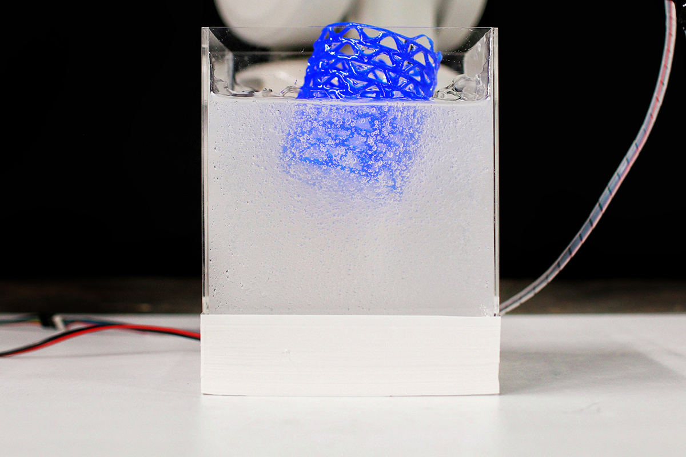
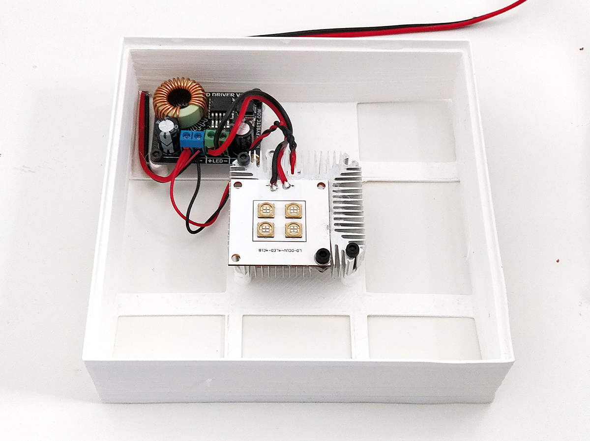
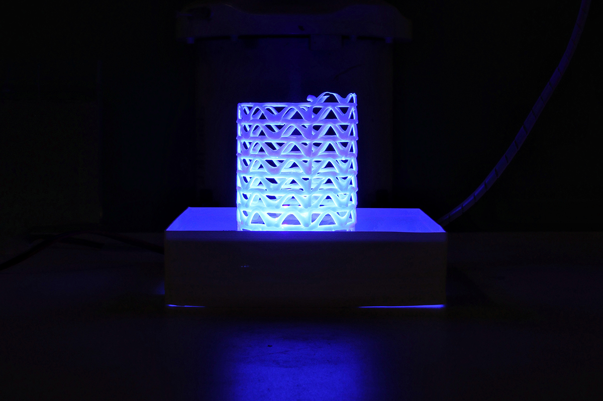

# UV Curing light box

### V1.0 Release 03-18-2019
- FirstPush on the extruder after testruns.

## Characteristics

- Base for light curing with UV where an acryl box or 150x150x150 sits
- Base for the acryl box
- Added cover for the box to avoid dehidration of the gel

* 3D printed parts
* UV led matrix 40w
* electronic holder
* 3mm allen screws 20-30-45mm lenght

## Assembly Steps

**FirstStep**

- Fit the electronic in the mounts with the led matrix fan, wire the main power input trought the hole

**SecondStep**

- You can take the acryl box to cure your pieces directly on the base

**ThirdStep**

- Sit the acryl box and use the cover to protect the gel while not printing

**Enjoy**

### Electronics

This holder is thought to be use with a standart UV LED MATRIX from a LCD UV PRINTER
You **must add a fan to avoid led burnout by overheat** this leds get really hot and need proper cooling

### Troubleshooting

1. *The acryl box sits to fit*

	* Heat the 3d printed parts with your house hairdrier to make the material soft and adjust the tolerances
	* Scale up the model to make it slightly bigger 101%

2. *The holes are not the correct size for my fittings*
	* Use a hand held driller with the correct size of your fittings and drill it, fmd plastic is a soft but flexible material that is really easy to drill trought.This is done in pourpose to help the screws last longer in place.

--

### Tools Needed

1. 3D PRINTER FDM machine
	* Work space of 200x200mmx200 minimum to print all parts. We used a Original PRUSA I3 printing all parts without support at 0.3mm layer height at 40% infill. PLA plastic is resistant enough but we will recommend to print in ABS or PETG( if you change the material the fittings might change)
2. Basic Screw drivers set (Philips,flat and allen keys for 2-5mm scresws)
3. Solder iron to make the connections

--
### BOM (Bill of materials)

1. [UV LED MATRIX + LED DRIVER MODULE](https://www.amazon.es/gp/product/B07QJCJWKK/ref=ppx_yo_dt_b_asin_title_o00_s00?ie=UTF8&psc=1)

2. [FAN AND HEATSINK](https://www.banggood.com/DC-12V-LED-light-Cooling-Cooler-Heatsink-With-Fan-For-5W10W-High-Power-p-1122515.html?rmmds=search)

3. [Acryl box 150x150x150mm](https://www.mwmaterialsworld.com/es/materiales/metacrilato/manufacturados-de-metacrilato/caja-de-metacrilato-transparente-sin-tapa.html)

4. [screws](https://www.amazon.es/Mcbazel-Stainless-Steel-Phillips-Screws/dp/B07KLRXNSH/ref=sr_1_5?__mk_es_ES=%C3%85M%C3%85%C5%BD%C3%95%C3%91&keywords=screw+set&qid=1575457678&sr=8-5)

--

### To do
*
--

### References

--
*March 2020, by [Eduardo Chamorro](http://eduardochamorro.github.io/beansreels/index.html).*
[IAAC](https://iaac.net/)-[FablabBarcelona](https://fablabbcn.org/)

LICENSE - CC BY-NC-SA
