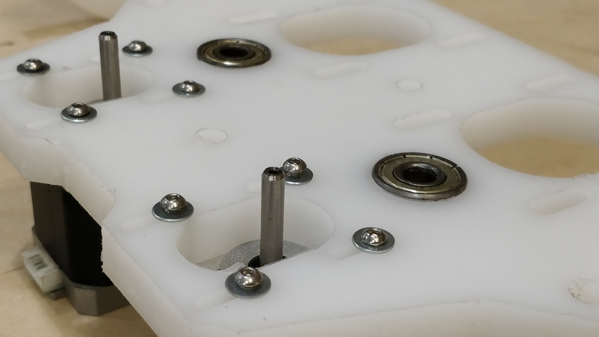
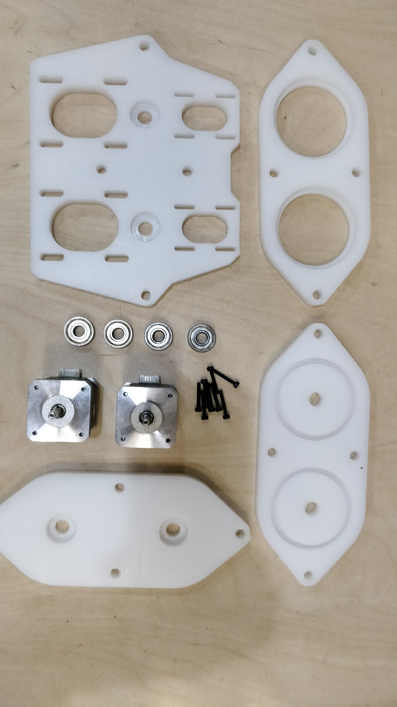

# Modular-Paste-DualExtruder-EndEffector

### V2.0 Release 09-03-2019
- Fix reltive coordinates
- wait delay now related to file speed and point to point distance

### V1.0 Release 31-01-2019
- FirstPush on a modular pipe paste extruder

## Characteristics

*January 2019, by Eduardo Chamorro, Yiannis Romanos Vogdanis.*

* Dual motor mount to control each paste individualy to get different mixing ratios
* Able to mount NEMA 17 OR 23 motors, to provide more o less torque depending on the paste and viscosity of what you want to extrude
* Modular design. The pipe lenght could be easily changed without having to disassemble the whole extruder.
* Flexible and selfsealing joineries on HDPE and PVC pipe
* Gear box separated from the end of the pipe to keep it clean and protected.
* Motor mounts can be change back and from to adapt to differente reduction ratios of different gears box.
* The piston can go completely out to allow easy to refill capacities and not needing to disassemble the extruder each time you need to refill it
* Light and compact.

### Troubleshooting

1. *Tube doesn´t fit on the hole pocketings*  

	* Trim the inside circle of the hpde with a cutter knife to make it easier to fit and hammer softly to introduce it and get a perfect seals  

2. *The holes are not the correct size for my fittings*
	* Use a hand held driller with the correct size of your fittings and drill it, hdpe is a soft but flexible material that is really easy to drill trought

--

### Tools Needed

1. CNC milling machine
	* Work space of 400x200mm minimum to cut all parts at once. We used a CNC STEP Raptor XLS for cutting the HDPE parts at 2500mm/min and 20.000rpm with a 6mm endmill 1 oflute bit.

2. 3d printer
 * Any kind of printer will work for these files We used a Kossel Pro printer FDM tipe printing at 0.3mm layer height and 95% infill 10 walss on perimeters.

--

### To do
* Test materials from water to pastes
* Check power of stepper motors
* Produce mount for cnc and robotic arms
* Be able to control different mixing speeds

--

### References

--
