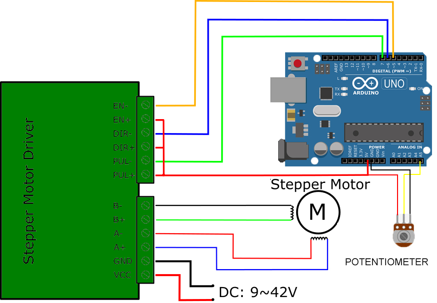

# Code for Stepper Motor+Potentiometer

### V1.0 Release 03-18-2019
- FirstPush on the extruder after testruns.

## Characteristics

- Simple movement of an stepper motor in both directions with a Potentiometer
- Follow the pin location on the arduino file to know how to connect the wiring

### Electronics

[Follow this guide on how to move an stepper motor with an arduino](https://circuitdigest.com/microcontroller-projects/controlling-nema-17-stepper-motor-with-arduino-and-a4988-stepper-driver-module)

### Troubleshooting

--

### Tools Needed

1. Arduino IDE software[link](https://www.arduino.cc/en/main/software)

--
### BOM (Bill of materials)

1.[Nema 17](https://www.amazon.es/Longruner-Impresora-4-Cables-Conector-LD08/dp/B07FKH52S5/ref=sr_1_1?__mk_es_ES=%C3%85M%C3%85%C5%BD%C3%95%C3%91&keywords=nema&qid=1584626346&sr=8-1) or [Nema 23](https://www.amazon.es/JoyNano-Stepper-Bipolar-retenci%C3%B3n-impresora/dp/B07H866S2F/ref=sr_1_7?__mk_es_ES=%C3%85M%C3%85%C5%BD%C3%95%C3%91&keywords=nema+23&qid=1584626403&sr=8-7)

2.[Motor driver 2A drv8825 for nema 17](https://www.amazon.es/DRV8825-Controladores-M%C3%B3dulo-disipador-ejemplo-impresoras/dp/B01E0KJDTO/ref=sr_1_3_sspa?__mk_es_ES=%C3%85M%C3%85%C5%BD%C3%95%C3%91&keywords=ramps+1.4&qid=1575457235&sr=8-3-spons&psc=1&spLa=ZW5jcnlwdGVkUXVhbGlmaWVyPUExTkhKWlE0TEtZQzA1JmVuY3J5cHRlZElkPUEwNTkyNDgwMUJNTTNJUjgwSEJaTyZlbmNyeXB0ZWRBZElkPUEwNTI0Mzk4MkZRUzZEWDYxMUk2JndpZGdldE5hbWU9c3BfYXRmJmFjdGlvbj1jbGlja1JlZGlyZWN0JmRvTm90TG9nQ2xpY2s9dHJ1ZQ==) or [Motor driver for nema 23](https://www.amazon.es/TopDirect-TB6600-Controlador-Stepper-Impresora/dp/B0711J1K66/ref=sr_1_3?__mk_es_ES=%C3%85M%C3%85%C5%BD%C3%95%C3%91&keywords=stepper+driver&qid=1584626353&sr=8-3)

3.[Arduino Uno x 1 ](https://www.amazon.es/Tarjeta-Microcontrolador-ATmega328P-ATMEGA16U2-Compatible/dp/B01M7ZB2B4/ref=sr_1_7?__mk_es_ES=%C3%85M%C3%85%C5%BD%C3%95%C3%91&keywords=arduino&qid=1576603241&sr=8-7)

5.[cables]()

6.[potentiometer](https://www.amazon.es/potenci%C3%B3metros-Sourcingmap-a15032000ux0093-100-kiloohmios-terminales/dp/B016W7SPZG/ref=sr_1_1?__mk_es_ES=%C3%85M%C3%85%C5%BD%C3%95%C3%91&keywords=potentiometer&qid=1584626447&sr=8-1)

--

### To do
*
--

### References

--
*March 2020, by [Eduardo Chamorro](http://eduardochamorro.github.io/beansreels/index.html).*
[IAAC](https://iaac.net/)-[FablabBarcelona](https://fablabbcn.org/)

LICENSE - CC BY-NC-SA
