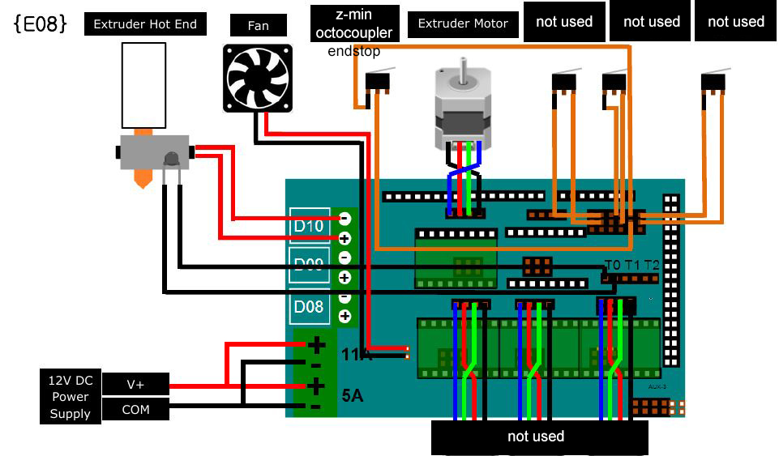

# Filament-Extruder-EndEffector

### V1.0 Release 02-12-2019
- FirstPush on the extruder after 40 hours of testruns.

## Characteristics

- Standalone filament extruder based on offtheshelve components. To be activated only with a switch or a digital signal(ON/OFF).
- Self control of temperature and coldprint avoidance(doesn´t allow to print if the temperature didn´t reached the goal Tº)
- On on/off procedure has retraction enable to avoid stringings.

* Simple nema 17 motor
* Standart E3D V6 HOTEND
* Standart RAMPS1.4+ARDUINO control board
* Fans 40x40 x1 and 50x50 x2 size
* 3mm allen screws 20-30-45mm lenght

### Troubleshooting

--

### Tools Needed

1. 3D PRINTER FDM machine
	* Work space of 100x100mmx100 minimum to print all parts. We used a Original PRUSA I3 printing all parts without support at 0.3mm layer height at 40% infill. PLA plastic is resistant enough but we will recommend to print in ABS or PETG( if you change the material the fittings might change)
2. Basic Screw drivers set (Philips,flat and allen keys for 2-5mm scresws)

--
### BOM (Bill of materials)

1.[Arduino Ramps1.4](https://www.amazon.es/HiLetgo-control-impresora-tablero-soporte/dp/B07DQN9N7T/ref=sr_1_11?__mk_es_ES=%C3%85M%C3%85%C5%BD%C3%95%C3%91&keywords=ramps+1.4&qid=1575457235&sr=8-11)

2.[Motor driver 2A drv8825](https://www.amazon.es/DRV8825-Controladores-M%C3%B3dulo-disipador-ejemplo-impresoras/dp/B01E0KJDTO/ref=sr_1_3_sspa?__mk_es_ES=%C3%85M%C3%85%C5%BD%C3%95%C3%91&keywords=ramps+1.4&qid=1575457235&sr=8-3-spons&psc=1&spLa=ZW5jcnlwdGVkUXVhbGlmaWVyPUExTkhKWlE0TEtZQzA1JmVuY3J5cHRlZElkPUEwNTkyNDgwMUJNTTNJUjgwSEJaTyZlbmNyeXB0ZWRBZElkPUEwNTI0Mzk4MkZRUzZEWDYxMUk2JndpZGdldE5hbWU9c3BfYXRmJmFjdGlvbj1jbGlja1JlZGlyZWN0JmRvTm90TG9nQ2xpY2s9dHJ1ZQ==)

3.[Arduino mega](https://www.amazon.es/ELEGOO-Microcontrolador-ATmega2560-ATmega16U2-Compatible/dp/B06Y3ZHPWC/ref=sr_1_1_sspa?__mk_es_ES=%C3%85M%C3%85%C5%BD%C3%95%C3%91&keywords=arduino+mega&qid=1575457226&sr=8-1-spons&psc=1&spLa=ZW5jcnlwdGVkUXVhbGlmaWVyPUEzUkxaU1BCQ1hXTkNBJmVuY3J5cHRlZElkPUEwNDQxODIyOE1RUDU2NTA4TFVZJmVuY3J5cHRlZEFkSWQ9QTA5MjQ4NTQxWU5NM0VUUk85VkdYJndpZGdldE5hbWU9c3BfYXRmJmFjdGlvbj1jbGlja1JlZGlyZWN0JmRvTm90TG9nQ2xpY2s9dHJ1ZQ==)

4.[E3D V6 1.75 EXTRUDER](https://www.amazon.es/XCSOURCE%C2%AE-Extrusora-distancia-termistor-TE601/dp/B01MFBN1QW/ref=sr_1_5?__mk_es_ES=%C3%85M%C3%85%C5%BD%C3%95%C3%91&keywords=e3d+v6&qid=1575457268&sr=8-5)

5.[40X40 FAN](https://www.amazon.es/Ventilador-40x40x20mm-21dBA-Sunon-EB40201S2-999/dp/B00MNJD73I/ref=sr_1_1_sspa?__mk_es_ES=%C3%85M%C3%85%C5%BD%C3%95%C3%91&keywords=40x40+fan&qid=1575457338&sr=8-1-spons&psc=1&spLa=ZW5jcnlwdGVkUXVhbGlmaWVyPUFNUTdKTkZJV1pXRDMmZW5jcnlwdGVkSWQ9QTA0MjU3MzcxRVBYRkI0TFNJVk9EJmVuY3J5cHRlZEFkSWQ9QTA3NTQ2MDkzR0FJREVBVEswWVIwJndpZGdldE5hbWU9c3BfYXRmJmFjdGlvbj1jbGlja1JlZGlyZWN0JmRvTm90TG9nQ2xpY2s9dHJ1ZQ==)

6.[50X50 FAN](https://www.amazon.es/AAB-Cooling-Fan-Ventilador-carcasa/dp/B01HTGBMA4/ref=sr_1_1?__mk_es_ES=%C3%85M%C3%85%C5%BD%C3%95%C3%91&keywords=50x50+fan&qid=1575457314&sr=8-1)

7.[NEMA 17](https://www.amazon.es/Longruner-Impresora-4-Cables-Conector-LD08/dp/B07FKH52S5/ref=sr_1_1_sspa?__mk_es_ES=%C3%85M%C3%85%C5%BD%C3%95%C3%91&keywords=nema17&qid=1575457302&sr=8-1-spons&spLa=ZW5jcnlwdGVkUXVhbGlmaWVyPUEyQTRMSDVGUTNDT1JPJmVuY3J5cHRlZElkPUEwMjIxMTY0MTQxTFpESFQwUUlNTSZlbmNyeXB0ZWRBZElkPUEwMTEzNTgwMjdNVDFJQVY3OFlKMiZ3aWRnZXROYW1lPXNwX2F0ZiZhY3Rpb249Y2xpY2tSZWRpcmVjdCZkb05vdExvZ0NsaWNrPXRydWU&th=1)

--

### To do
* Add serial communication for speed control of the extruder
--

### References

--
*December 2019, by [Eduardo Chamorro](http://eduardochamorro.github.io/beansreels/index.html).*
[IAAC](https://iaac.net/)-[FablabBarcelona](https://fablabbcn.org/)

LICENSE - CC BY-NC-SA
