# Fabricatable Tools

Fabricatable tools is a collection of **end effectors**, **tools** and extra hardware that can be made using a standard set of existing computer-controlled machines; with minimal use of speciality parts, processes or skills. The type of machines needed may include CNC-milling, lasercutter, and 3d-printers.
We want to enable students to build their own tools, to expand their own capabilities and develop their research faster.

*All the tools are documented in detail inside each repository (click on each link for more details)*

---
## END EFFECTORS

[Link to all the endeffector 3d models(to use for robotic visualization)](ExtruderCollection.3dm)

### Seringe Holder 300-400ml for ABB-UR table robots

End Effector to mount on robot arms and print with industrial adhesive dispensers of 300-400ml
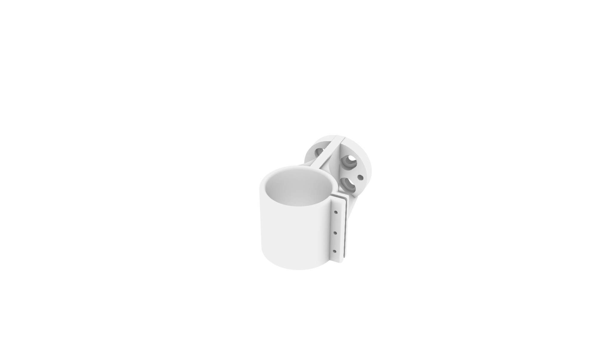
[Link to repo](3DPRINT-CartridgeMountABB/README.md)

### 3 Axis Teaching Tool

End Effector to mount on robo arms and show the 3 axis movements to new users (designed for Kuka KR16-2)
To modify for other robots looks for the flange design in this same repo.

[Link to repo](3DPRINT-KukaKr16-2/README.md)

### Minipellet extruder

End Effector to extrude pellets at around 500 to 700gr and hour
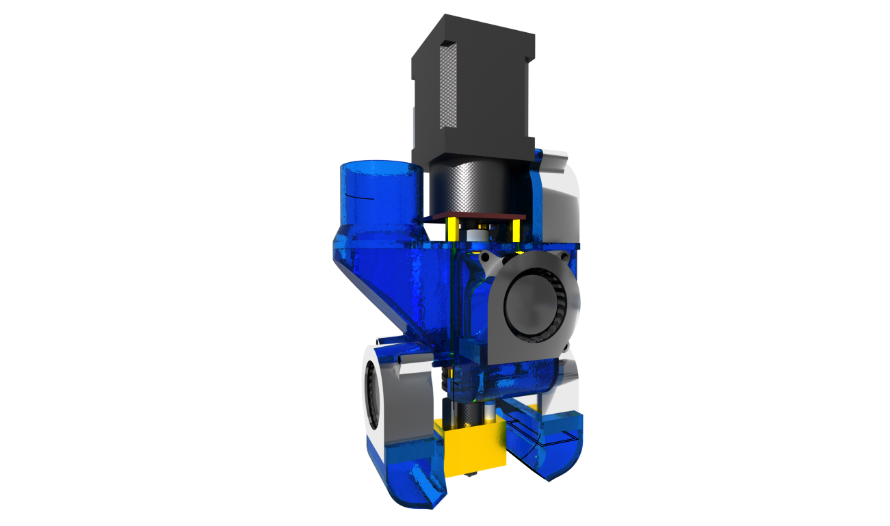
[Link to repo](3DPRINT-MiniPelletExtruder/README.md)

### Syringe Paste Extruder

End Effector to extrude really liquid pastes or fluids up to 100ml capacity
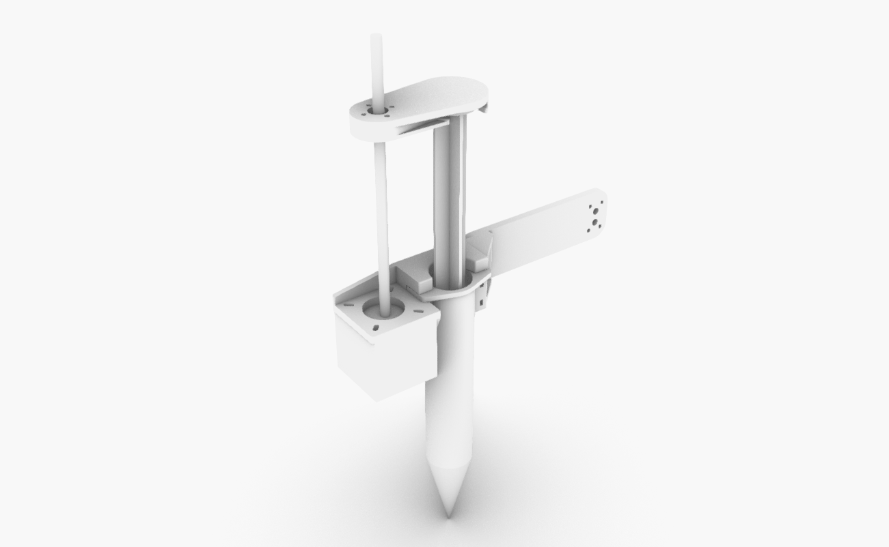
[Link to repo](3DPRINT-SyringePasteExtruderSimple/README.md)

### Syringe Paste Extruder Geared

End Effector to extrude medium/thick pastes to 100ml capacity
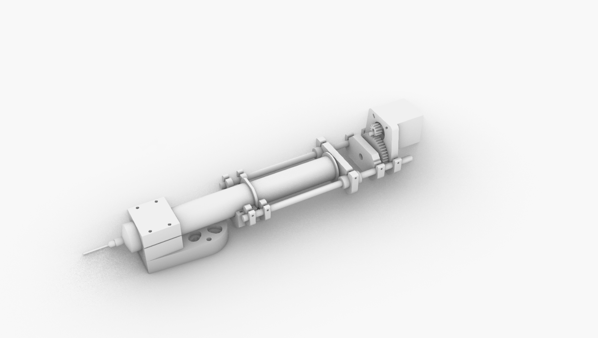
[Link to repo](3DPRINT-SyringePasteExtruderGearBox/README.md)

### Syringe Paste Extruder High Power Geared
**W.I.P WORK IN PROGRESS-NOT FINISHED YET** SyringePasteExtruderSimple
End Effector to extrude thick pastes difficult to extrude, up to 100ml capacity

[Link to repo](3DPRINT-SyringePasteExtruderGearBoxHighPowerNema23/README.md)

### Perilstatic Liquid Extruder

End Effector to extrude liquids in difficult locations (was designed for in Gel printing)
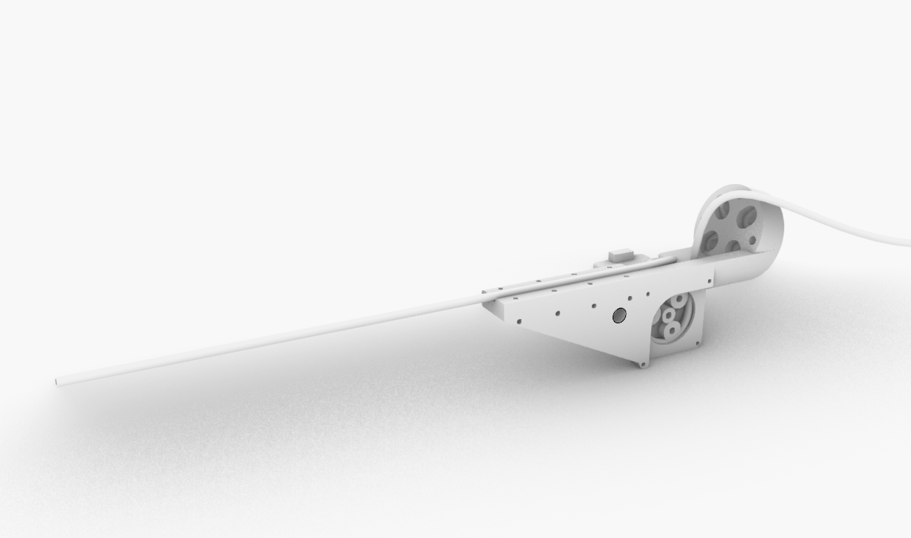
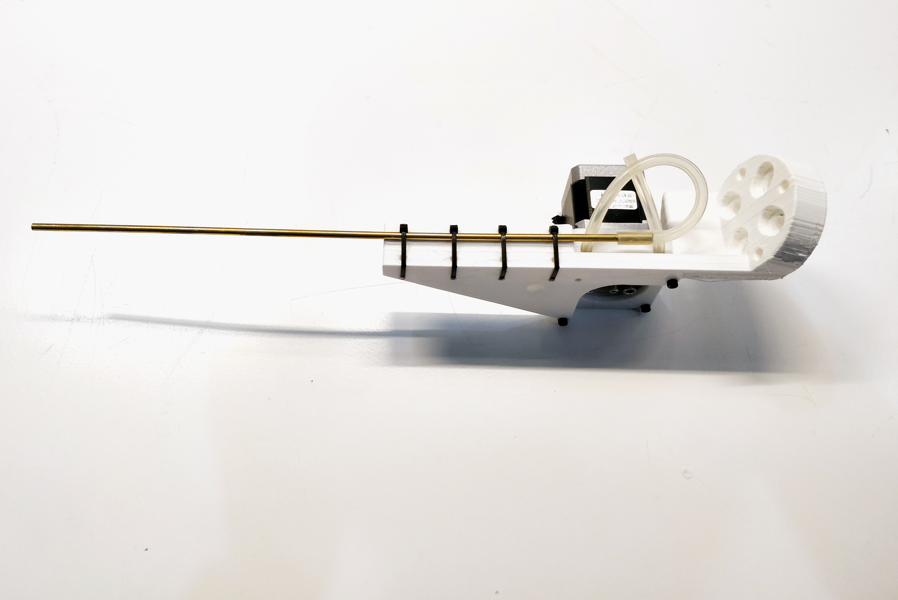
[Link to repo](3DPRINT-PerilstaticExtruder/README.md)

### Filament extruder - FDM 3d printing

End Effector to extrude plastic filament (max temperature 240º - max speed 30mm/s),**mostly 3d printed**
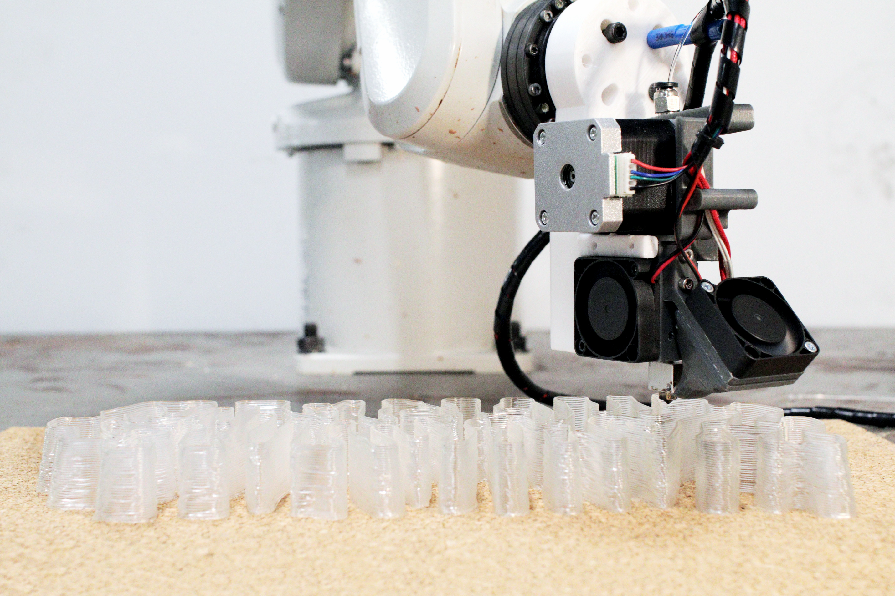
[Link to repo](3DPRINT-FilamentExtruder/README.md)

### Filament extruder HIGH FLOW - FDM 3d printing

End Effector to extrude plastic filament (max temperature 260º - max speed 60mm/s),**mostly COMMERCIAL PARTS**
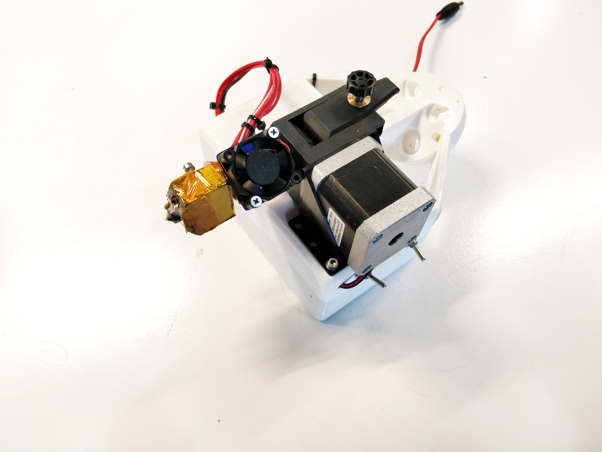
[Link to repo](3DPRINT-FilamentExtruder-HighFlow/README.md)

### Dual Paste Extruder Nema17/23 3liters (W.I.P)

Dual material extruder to be made in cnc *Documentation not finished*
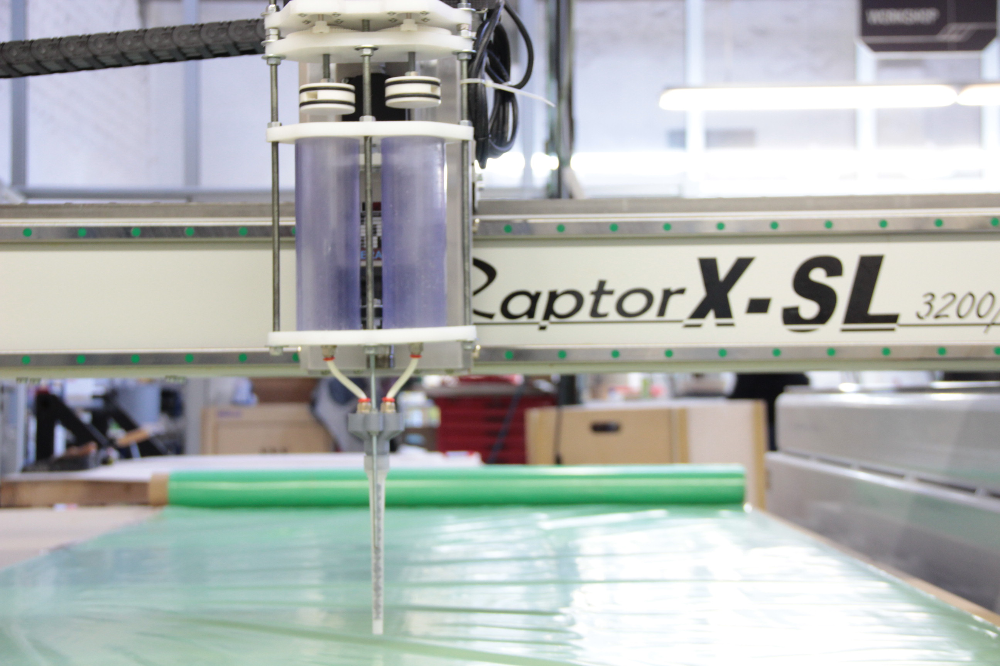
[Link to repo](CNC-DualExtruder-EndEffector/README.md)

---
## END EFFECTOR ACCESORIES - EXTRA

### Robot Mount Adaptor ABB-UR

Adaptor or mount design for Small robotic arms ABB120-ABB140-UR3-UR5-UR10
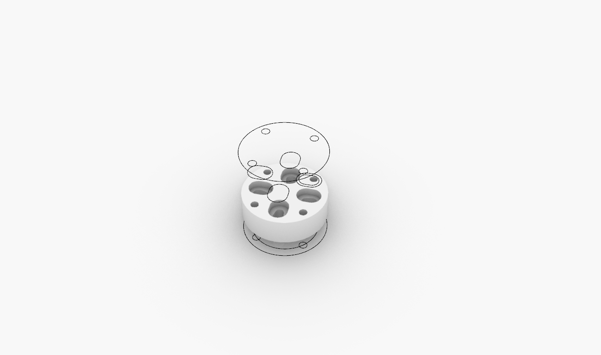
[Link to repo](3DPRINT-Adaptor-ABB-UR/README.md)

### Filament extruder HIGH FLOW - FDM 3d printing

Collection of pipe holders 54-64mm diameter for Small robotic arms ABB120-ABB140-UR3-UR5-UR10
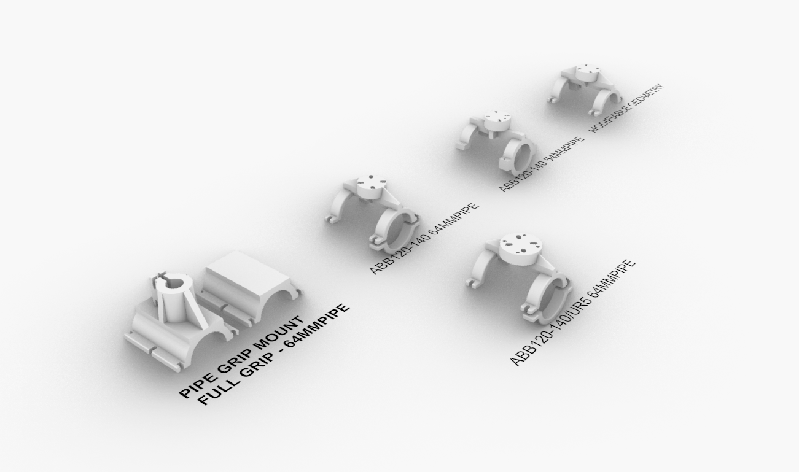
[Link to repo](3DPRINT-CartridgeHolder/README.md)

### Pellet Cones for pellet extruders+ Fan Cooling Mount (Massive Dimension)

Design of a pellet feeder cone for Massive Dimension pellet extruder + fan cooling mount
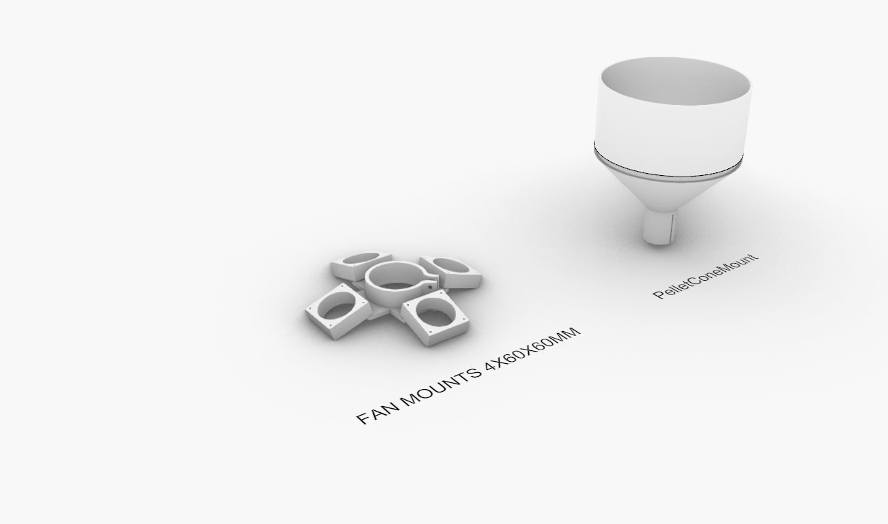
[Link to repo](3DPRINT-ExtruderPelletMassiveDimensionCone/README.md)

### Pellet Cones for pellet extruders(WASP)

Design of a pellet feeder cone for Massive Dimension pellet extruder + fan cooling mount
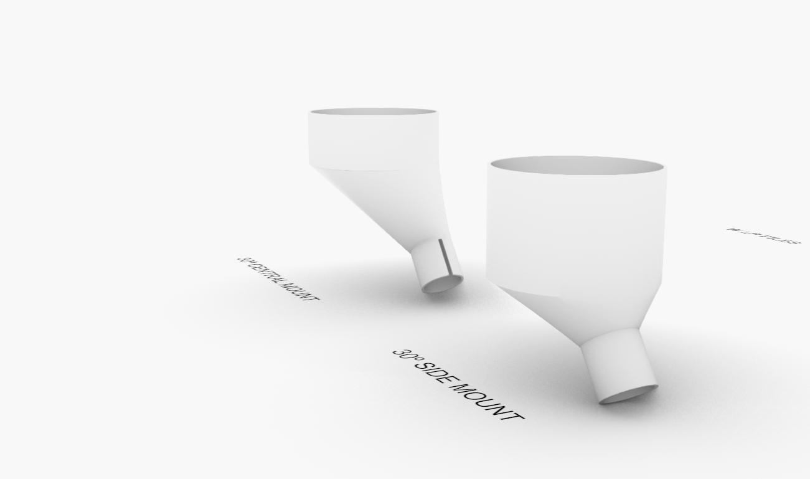
[Link to repo](3DPRINT-ExtruderPelletWaspCone/README.md)

---
## TOOLS HARDWARE- EXTRA

### Liquid Mixer

Simple material/fluid/powder mixer
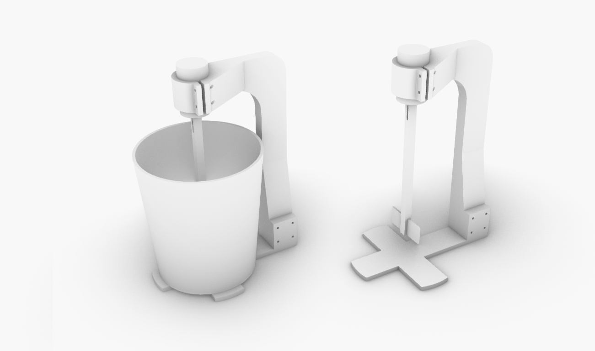
[Link to repo](3DPRINT-LiquidMixer/README.md)

### UV curing base

Base for acrylic box to host the UV CURE LIGHT while in GelPrinting + Acryl Cover
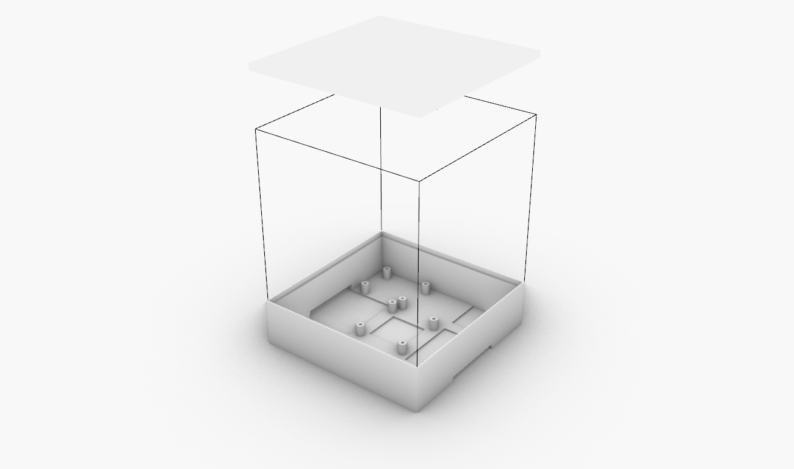
[Link to repo](3DPRINT-UVCuringBase/README.md)

### Spindle Electronics Box

Box to host the electronics of a [CNC 300-500w spindle](https://www.aliexpress.com/item/32702815007.html?spm=a2g0o.productlist.0.0.768dbae0ZqSlVb&algo_pvid=3afa867d-ac6d-451a-80cc-3c97a41cd0ee&algo_expid=3afa867d-ac6d-451a-80cc-3c97a41cd0ee-1&btsid=0b0a187b15845263415838262e3e37&ws_ab_test=searchweb0_0,searchweb201602_,searchweb201603_)
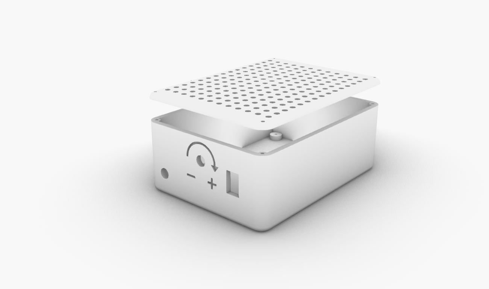
[Link to repo](3DPRINT-SpindleBox/README.md)

---
## ARDUINO CODES

### Base code of WaspPellet extruder Controlbox

WorkCode of the rewired wasp pellet extruder of Iaac/Fablab Barcelona 2020

[Link to repo](CODE-WaspPelletExtruder/README.md)

### Move an stepper motor with a potentiometer

Bidirectional movement with speed change
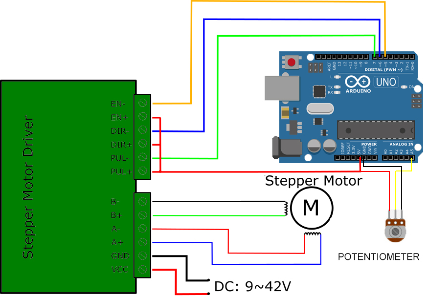
[Link to repo](CODE-SimplestepperPot/README.md)

### Move an stepper + PID temperature control + double heaters control

Firmware for automatization the extruding process for the filament extruders
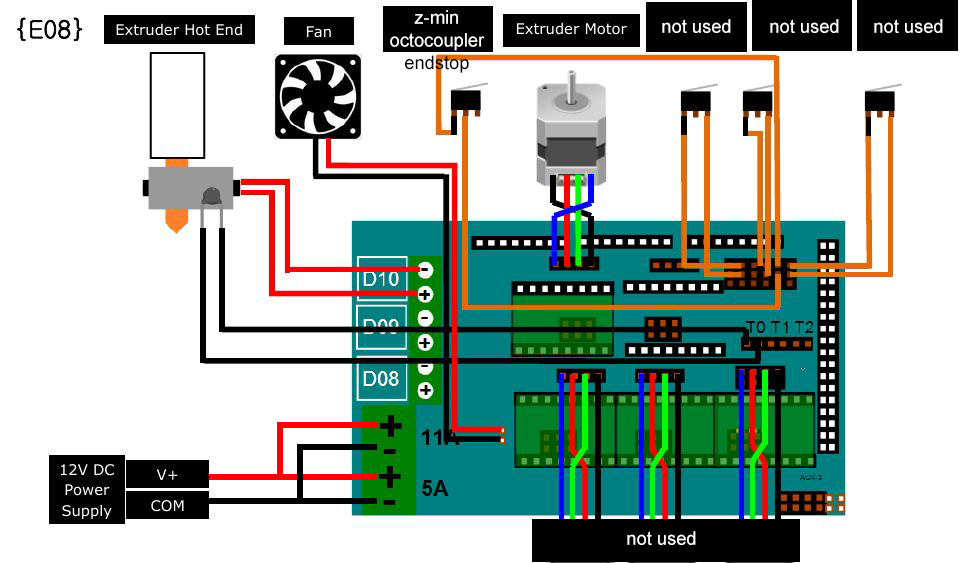
[Link to repo](CODE-StepperDoubleHeater/README.md)

### Marlin 3d printer Firmware
[Link to repo](CODE-Firmware-RawMarlin1.1.9/FIRMWARE-RawMarlin1.1.9.rar)

### Contribution

**You can download the files for individual machine. If you improve on the designs you can share them back with a pull request or send it by email to [us](eduardo.chamorro@iaac.net) (we will love that you contribute with your upgrades or modifications)**

Feel free to expand and improve all sections of this project and wiki.

- Save all the images in the "img" folder
- Save everything in just one rhino clean file
- Save the stl files separetly
- Add documentation and step in the "readme" file
- Document in [markdown](https://github.com/adam-p/markdown-here/wiki/Markdown-Cheatsheet)
- all the files in mm
- make a B.O.M (bill of material) with all the hardware and components needed

### References - Equipment

- [Build your own 3Dprinter](https://reprap.org/wiki/RepRap)
- [Build your own Lasercutter](http://laserduo.com/)
- [Build your own CNC](https://github.com/fellesverkstedet/fabricatable-machines/wiki)

*For people with no time or knowledge to build his own machine we recommed this affordable hardware*

- [Buy your own low cost 3Dprinter-Ender3 200$](https://www.creality3dofficial.com/products/creality-ender-3-pro-3d-printer)
- [Buy your own medium cost 3Dprinter - Prusa i3MK3S 800$](https://shop.prusa3d.com/en/3d-printers/180-original-prusa-i3-mk3-kit.html#)
- Buy your own low cost LASERCUTTER - (We don´t recommend any low cost chinese lasercutter as we consider them really dangerous and without any safety mechanism)
- [Buy your own medium cost LASERCUTTER 4000$](https://glowforge.com/)
- [Buy your own low cost CNC machine 3018PRO 190$](https://www.amazon.es/Vogvigo-M%C3%A1quina-Control-pl%C3%A1stico-acr%C3%ADlico/dp/B07MCTLW7V/ref=sr_1_4?__mk_es_ES=%C3%85M%C3%85%C5%BD%C3%95%C3%91&keywords=cnc&qid=1584615034&sr=8-4)
- [Buy your own medium cost CNC machine-Shapeoko 1200$](https://carbide3d.com/shapeoko/)

--
*March 2020, by [Eduardo Chamorro](http://eduardochamorro.github.io/beansreels/index.html).*
[IAAC](https://iaac.net/)-[FablabBarcelona](https://fablabbcn.org/)

LICENSE - CC BY-NC-SA
